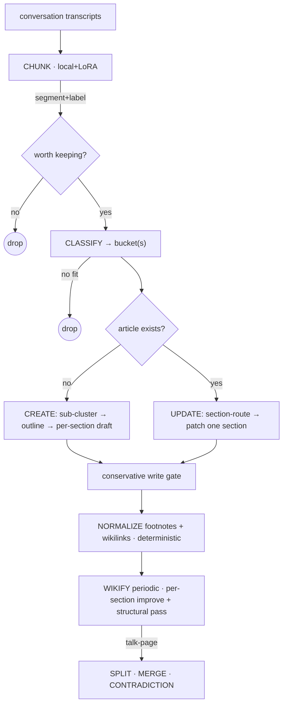

# Memory synthesis — the local Morpheus (M1 design)

Status: **design**, 2026-06-26. Companion to [memory-system.md](./memory-system.md)
(the M0 substrate: vault, read tools, CLI, scheduling — all landed). This doc is
the M1 design for the **write side**: the synthesis pipeline that turns raw
conversations into well-formed wiki articles, **on local models**.

The inspiration and proof-of-concept is Lucien / The Dreaming / Morpheus
(`../lucien`) — it works, but every stage runs on a cloud model (`claude --model
opus`, `pi`). The whole point of M1 is to keep every learning from Lucien and
**solve the cost by running the pipeline locally**, using one local base model +
a per-stage LoRA adapter trained from Lucien's corpus (the e4b chunk adapter is
the first of these — designed components of the appliance, each distilled from
the cloud pipeline's gold output).

Guiding principle, inherited verbatim from Lucien: **do whatever Wikipedia does.**
Wikipedia turned a crowd of strangers into the largest organized, continuously-
updated knowledge base ever built. We are not going to out-design it — we copy
its conventions (articles, sections, talk pages, citations, wikilinks, edit
history) and supply the per-edit labor with local models instead of volunteers.

And the division of labor is fixed: **AI does the judgment; deterministic code
enforces the invariants we can't trust AI on** (footnote bijection, wikilink
canonicalization, the conservative write gate).

## Current state: ZERO articles

The vault starts empty. So the pipeline has to handle the **creation flow**, not
just steady-state updates — most of the early design discussion assumed an
existing structured article to patch; from zero there is nothing to patch yet.
The two flows are genuinely different operations and the doc treats them
separately below.

## The pipeline (DAG)

```
WRITE · the local Morpheus  (what `mlx-bun memory synthesize` runs)
══════════════════════════════════════════════════════════════════

  conversation transcripts  (ingest, by cursor)
        │
        ▼  CHUNK ································· local model + chunk LoRA   [e4b ✓]
  single-topic (segment + label)
        │
        ▼  FILTER — worth keeping? ──no──▶ drop
        │ yes
        ▼  CLASSIFY → bucket(s)   many-to-many ──no fit──▶ drop
        │   bucket ≈ article; from zero, buckets are PROPOSED (taxonomy emerges)
        ▼  SYNTHESIZE   ······························ local model + synth LoRA
        │   ├─ article does NOT exist  →  CREATE  (sub-cluster → outline → per-section draft)
        │   └─ article EXISTS          →  UPDATE  (SECTION-ROUTE → PATCH one section)
        │        + conservative write gate (≥70% prose floor, every citation survives, weak → NO-OP)
        ▼
  article written / one section changed (rest byte-identical)
        │
        ▼  NORMALIZE (deterministic code, not a model)
        │   footnote renumber/repair · wikilink canonicalize
        ▼
        ▼  WIKIFY (periodic, local model + wikify LoRA)        ◀── distinct LLM node
        │   "make this a BETTER version" — per-section improve + structural pass
        └──▶ Talk-page signals (embedding/silhouette): SPLIT · MERGE · CONTRADICTION


READ · any chat agent  (M0, landed; read-only via memory_* tools)
══════════════════════════════════════════════════════════════════
  question ─▶ search / toc ─▶ read section · follow [[links]] ─▶ reason ─▶ answer
```



## The two synthesis flows

### CREATE (cold-start / bootstrap — the zero-article case)

Trigger: a bucket has accumulated enough chunks (≥N, conservative) and has **no
article file yet**. Naively this is whole-article generation from a pile of
chunks — exactly the open-ended task a small local model is *worst* at. So we
decompose it the same way we decompose updates — **section-granular**:

1. **Sub-cluster** the bucket's chunks into proto-sections (cluster the chunks
   *within* the bucket — the cohesion/embedding machinery applies one level down;
   silhouette is a strong cohesion signal, ρ≈0.68 vs the judges).
2. **Outline** — name each section from its sub-cluster, write the lead. A small
   structural task, not long-form prose.
3. **Draft each section** by synthesizing only its sub-cluster's chunks — the
   *same bounded per-section operation* as a patch, just starting from empty.
4. **Assemble** → article with `# Title`, lead, sections, `## References`, TOC.

So even creation never asks the model to hold a whole article in its head: it's
sub-cluster → outline → N bounded section drafts. Conservative bootstrap bias:
**under-cover rather than over-cover** — thin buckets stay `{{stub}}` or wait for
more material (Lucien's lesson: twenty good articles beat a sprawling mediocre
set).

### UPDATE (steady state — article exists)

1. **SECTION-ROUTE** the new chunk to the section(s) it affects, via the TOC —
   "this topic affects THESE sections" (e.g. a Reflecting-Pool-renovation chunk →
   the *Renovation* section, and possibly an *Abuse-of-Power* section of a Trump
   article). Many-to-many at section granularity. If it fits no existing section,
   the route is "new section."
2. **PATCH** just that section: hand the model the section text + the chunk, ask
   it to weave the chunk in with a `[^N]` citation. Bounded in, bounded out.
   Facet extraction is implicit — the same chunk becomes the renovation facts in
   one section and the no-bid-contract framing in another, because the model
   writes what's relevant to the section it's editing.
3. **Everything else stays byte-identical** — only the routed section is rewritten.

Both flows share the **conservative write gate** (already specced in
`synthesize.ts`): preserve prose, ≥70% word-count floor, every original `conv:`
citation survives, integrate-not-overwrite; a weak local pass is gated to NO-OP
rather than allowed to corrupt the vault.

## Why WIKIFY is its own (necessary) node

Section-patches are greedy and local. Over many of them an article accumulates
cruft: a section sprawls, sentences go redundant, the lead goes stale, section
order drifts. **Wikify is the periodic global pass that keeps the article *good*
— "how do I turn this into a better version of this article" — and it is
necessary; without it you just keep bolting things on.** This is the LLM
editorial-restructure (Lucien's "Editorial restructure" commits), *distinct from*
the deterministic footnote/wikilink normalize that the current `wikify.ts` stub
conflates it with.

Structure makes even this global pass decompose toward local: wikify can run
**per-section "improve this section"** + a **cheap structural pass over the TOC**
(reorder, fix the lead, re-section, emit split/merge signals) instead of one
whole-article regeneration. So wikify is local-tractable for the same reason
synthesis is: sections.

## Data model — pointers, not copies

The SQLite store (`~/.cache/mlx-bun/memory.sqlite`) is **derived, rebuildable**
state — not the source of truth. The principle that keeps it lean and consistent:
**materialize text in exactly one place; everything else points.**

- **Messages hold the text, once.** A `messages` table (text per message), keyed
  by `(conv, position)`.
- **A chunk is a pointer range, not a copy.** `chunks(id, conv, start, end, label)`
  — a segmentation is *where the boundaries are*, so storing it as a message range
  + label is the natural representation. Synthesis *dereferences* to message text
  only when it reads a chunk. Re-chunking rewrites pointer rows, never text.
- **Assignments are join tables (many-to-many).** `chunk_buckets(chunk_id,
  bucket_name)` and, for the section design, `chunk_sections(chunk_id, article,
  section_anchor)` — "this chunk affects THESE sections of THESE articles."
- **The article markdown is the only materialized synthesis.** Its `[^N]:
  conv:HASH` citations are themselves *pointers back to source conversations*, not
  copies. The vault is the precious git-tracked truth for *articles*; the DB is the
  rebuildable index for *pipeline state*.

**The current `db.ts` stub violates this and must be fixed for M1** (it mirrors a
naive copy design, not Lucien's pointer design):
- `conversations.transcript` stores the whole transcript blob AND `chunks.text`
  copies each slice → the same text twice. Replace with a `messages` table +
  pointer `chunks` (drop `chunks.text`).
- `chunks.bucket TEXT` is one-bucket-per-chunk → breaks many-to-many. Replace with
  `chunk_buckets`. Add `chunk_sections` for the section-route output.
- `synthesized_bucket_chunks` → `synthesized_chunk_sections(article, section_anchor,
  chunk_id, synthesized_at)` so the patch ledger is per-section (fold each chunk
  into each section exactly once).

Target tables: `messages` · `chunks` (pointers) · `conversations` · `buckets` ·
`chunk_buckets` · `chunk_sections` · `synthesized_chunk_sections` · `watermarks`.

### Engine: bun:sqlite now, Turso swappable (for vectors)

Build M1 on **`bun:sqlite`** — native to Bun, zero-dependency, synchronous, the
most battle-tested DB there is, and already the project's pattern (`JobStore`,
`EvalDB`, `registry`, `MemoryStore`). No reason to pay friction on day one.

**Turso** (the current product — a from-scratch Rust rewrite of SQLite that is
*embedded / on-device / offline / SQLite-compatible*, NOT the old cloud-sync
product) is the evaluation path. Its one concrete payoff for us is **native vector
search** — and this design is embedding-heavy (section-routing, semantic article
search, the silhouette signals). Reasons to defer rather than adopt now: it's a
young engine vs C SQLite, and the Bun-integration story (native binding vs
FFI/overhead) needs checking.

The decision is cheap to defer because (a) Turso is SQLite-*compatible* so the
schema/SQL above is identical either way, (b) `MemoryStore` already wraps the DB
behind a small class, so it's a driver swap not a rewrite, and (c) this DB is a
**rebuildable cache** (truth = vault + git), so it's a low-risk place to adopt a
younger engine. Plan: keep the SQL standard, keep the driver swappable, and switch
to Turso *if/when* its vector search beats in-process cosine (or `sqlite-vec`) at a
corpus size that actually needs ANN.

## The cascade (why local is possible at all)

```
clean single-topic chunks → clean buckets → clean section-routing → bounded section-patch
        └──── purity at the root ────┘
```

Each stage's locality depends on the prior stage's cleanliness. If a chunk fuses
two topics, it pollutes every section it's routed into. So **chunk purity is the
foundation of the whole local system** — not an abstract metric.

Caution from the chunk research (research-journal, reports/orpo-chunk-paper):
embeddings measure **cohesion/dispersion well** (silhouette ρ≈0.68 per-conv vs
the LLM judges) but **purity/contamination poorly** (−intraSpread ρ≈0.32, ns
within variants). So a clean-bucket guarantee cannot lean on a cheap embedding
signal — it rides on the local **chunker** actually being good at single-topic
splitting (the e4b adapter's real job), backed where needed by a non-embedding
purity check, not by cosine geometry.

## Stage → model → adapter

| stage | file | model | adapter |
|---|---|---|---|
| chunk | `src/memory/chunk.ts` | local | **chunk LoRA (e4b chunk-300, exists)** |
| classify | `src/memory/cluster.ts` | local + embeddings | classify LoRA (TODO) |
| synthesize (create/update) | `src/memory/synthesize.ts` | local | synth LoRA (TODO) |
| normalize | `src/memory/wikify.ts` (rename) | **deterministic code** | — |
| wikify (LLM) | **new node** | local | wikify LoRA (TODO) |

Section-routing (the new intra-article step) is embeddings-shaped: embed the
chunk (or its label) and the article's section headings/lead (from `parseToc` /
`extractSection`, already in `vault.ts`), route to the nearest section(s) over a
threshold. The local Qwen3-Embedding backbone (bit-exact, served, `/v1/embeddings`)
is exactly the "vector search over articles, not conversations" the vision calls
for — now applied at section granularity.

## What changes in the scaffold

The M1 stubs are wired (`pipeline.ts` orchestrates ingest→chunk→cluster→
synthesize→wikify→changelog; stage bodies throw "not implemented"). Two
corrections vs the stubs:

1. **`synthesize.ts` is whole-article today.** Make it `create-or-update`, with
   update = section-route + section-patch (not whole-article regeneration).
2. **The LLM wikify node is missing.** The current `wikify.ts` is *only*
   deterministic normalize. Keep that (rename to `normalize.ts`), and add a
   distinct **LLM wikify** node for the periodic "better version" pass.

## Build sequence

Cold-start first, because the vault is empty and you can't patch what doesn't exist:

1. **Wire CHUNK** to the e4b chunk adapter (`chunk.ts`) — the one stage with an
   adapter in hand. Verify single-topic chunks + labels on real conversations.
2. **CLASSIFY from zero** (`cluster.ts`) — emergent bucket taxonomy
   (`Meta/Buckets.md`); assign chunks to buckets, propose new ones; filter no-fit.
3. **CREATE flow** (`synthesize.ts`) — sub-cluster → outline → per-section draft
   for buckets crossing the chunk threshold. Behind the conservative gate. This
   is what gets us from zero to a first set of articles.
4. **NORMALIZE** (`normalize.ts`) — wire the deterministic footnote/wikilink
   repair (`vault.ts` already has the resolver).
5. **UPDATE flow** — section-route + patch, once articles exist to update.
6. **WIKIFY (LLM)** + Talk-page split/merge signals — once articles have
   accumulated enough cruft/drift to need them.

Steps 1–4 are the cold-start path (zero → first articles); 5–6 are steady state.

## Open questions

- **Article granularity / when to CREATE** — chunk threshold per bucket; when a
  bucket should become one article vs several (the vision's "soft size caps").
- **Section-route confidence** — threshold for "fits an existing section" vs
  "new section needed" vs "route to a different article."
- **Provisional facts** — representing "work set to begin July" so the next pass
  cleanly updates it to "began / completed" (temporal/trajectory tracking).
- **Create vs strong-model** — is first-creation good enough on the local model,
  or is bootstrap the one place a stronger model is worth it (vision: bootstrap is
  heavier but the same code path)?
- **The purity check** — what non-embedding signal guarantees clean buckets.
