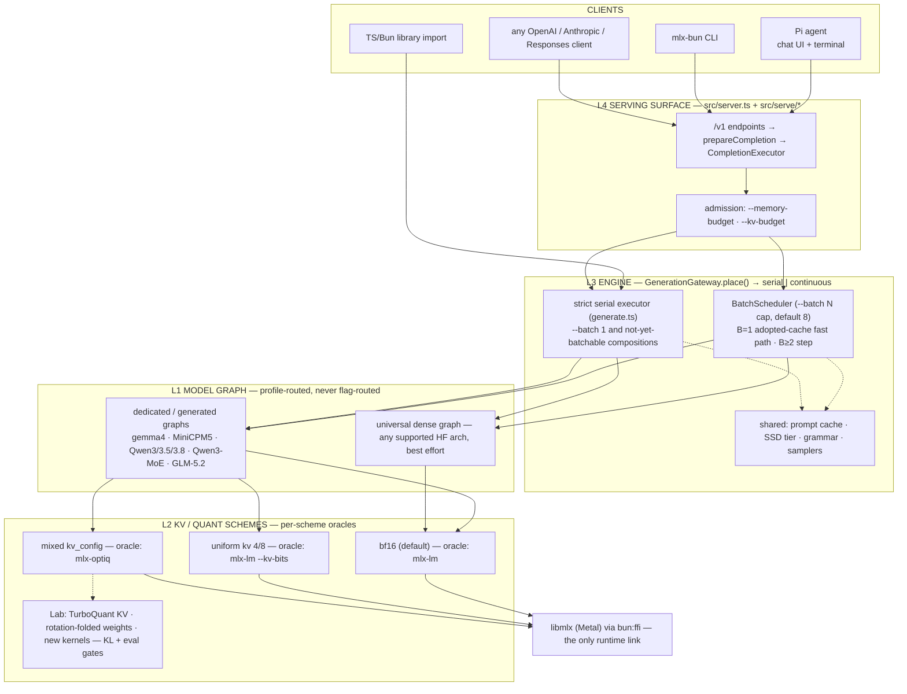

# Engine architecture — four layers, per-scheme oracles, one request path

This is the canonical architecture doc for mlx-bun's engine. It owns:

- the **four layers** (L1 graph / L2 KV+quant schemes / L3 engine / L4 surface)
  and the rule that features decompose along them;
- the **fidelity tiers** — L1 = mlx-lm bit-exact, L2 = mlx-optiq bit-exact,
  Lab = no-oracle experiments gated by KL/eval and a paired A/B before any
  default — and the decision procedure that places every optimization;
- the **naked default IS L1** decision (2026-07-05);
- the **engine** decision that concurrency is the batch size;
- the **request path** as it exists in `src/` today, the single-path rule, and
  the known deviations from it;
- the **flag end-state** and how it maps onto the layers.

Folded in (2026-08-23): `docs/design/unified-engine-frontier-plan.md` (tier framing, two axes, flag
classification) and `docs/archive/investigations/faithful-l1-consolidation.md` (the 2026-07-04 faithful→L1
consolidation and the 2026-07-05 deletion pass, now the History section).
Status and changelog prose lives in PLAN.md — see "Decision: naked default =
--l1; levers must beat the baseline (2026-07-05, Josh)" for the decision
record and "Serving architecture consolidation" for the live S0–S4 work. Every
`src/` claim below was re-read against the tree on 2026-08-23; where an older
draft of this doc disagreed with the code, the code wins and the note says so.

Companions: `docs/design/batching.md` (B=1 gap numbers), `docs/design/batching.md` and
`docs/design/batching.md` (scheduler mechanics — the mode-switch decision there is
superseded by §5), `docs/design/unified-engine-frontier-plan.md` (the S0–S3 seam),
`decode-speed-program.md` (the only doc that ranks speed levers; it also
carries the oMLX port ledger that used to be `docs/design/decode-speed-program.md`).

---

## 1. The two-part product and the contract

1. **A drop-in replacement for mlx-lm: everything they do, bit-exact.** This is
   the default. Parity is only *defined* over outputs mlx-lm can produce — you
   cannot ask for "mlx-lm's bits under mixed-precision KV" because mlx-lm
   cannot output anything under it.
2. **Beyond mlx-lm — features you opt into by deliberately trading the parity
   guarantee for something you value more**, each answering to its own oracle:
   mixed-precision KV (optiq), structured output (oMLX/xgrammar), speculative
   decoding (mlx-lm's `speculative_generate_step`; optiq for the KV-borrowing
   assistant drafter), prompt caching (mlx-lm's `LRUPromptCache`), prefix
   sharing and paged KV (vLLM/SGLang), multi-model switching (optiq
   per-request switching / oMLX EnginePool).

**THE CONTRACT (Josh, 2026-07-05) — two rules that compose:**

1. **The drop-in promise: the same BITS as mlx-lm.** How the bits are produced
   (storage, kernels, scheduling, engine, language) is the space we compete in.
2. **The oracle for anything is whoever already does that thing.** Want
   mlx-lm's decode → mlx-lm. optiq's mixed KV → optiq. vLLM's paged attention
   → vLLM: read their implementation, copy what they did, verify against them,
   then optimize. "No oracle" means *nobody* does the thing — genuine research
   — and that, and only that, is what the Lab is for.

Verification form follows the oracle's framework: same-libmlx oracles (mlx-lm,
optiq) admit bit-exact gates; cross-framework oracles (vLLM, CUDA/PyTorch)
anchor the algorithm and behavior while rule 1 still binds the output bits in
the default regime. "Faithful" kernel-set identity is the easiest route to
same-bits, not the contract; the one constraint bit-exactness puts on an
implementation is math/reduction order.

Two consequences drive everything below:

- **The baseline must be even and proven before optimizing.** The L1 path is
  bit-exact with mlx-lm and at decode parity on every model (PLAN.md, the
  2026-07-05 decision). Anything claiming to beat it proves it with a paired
  A/B on a stable pass; otherwise it is noise or a regression.
- **Frontier-shifting work is usually a quality-per-byte play, not a raw kernel
  play.** Mixed-precision quantization (weights and KV) moves memory down while
  holding or raising intelligence. Quantized KV stays first-class even though
  it lost the speed A/B: it buys context headroom.

The frontier axes we measure: memory (generation peak, fit-model), decode
tok/s (paired h2h, stable cells), prefill/TTFT, batched aggregate throughput,
and intelligence (the frozen eval suite in evals.sqlite). Curated numbers live
in `docs/reference/benchmarks.md`.

## 2. The four layers

### Layer responsibilities (the contract)

1. **Model graph (L1)** — one forward step given hidden + caches; attention
   dispatches on the *cache type it is handed* (bf16 → `ops.sdpa`, quantized →
   the quantized SDPA); shape-generic in B; selected by model profile, never by
   flags. *Responsibility: the numerics of a step, for any B, for whatever
   cache it is given.* The contract ENDS AT LOGITS.
2. **KV scheme (L2, cache classes)** — the memory format and its semantics:
   bf16 / uniform / mixed per-layer / TurboQuant; conversion timing (bf16
   prefill → quantize populated rows, optiq's hook semantics); in batched form
   the multi-row layout (padding, per-row rope, merge/extract/extend/filter).
   *Responsibility: the scheme PER ROW — a row's bytes and math identical solo
   or batched. This is where each scheme's oracle binds.* In code: `KvScheme`
   (`src/kv-scheme.ts`, kinds `bf16 | affine-uniform | affine-config | turbo`),
   the cache classes in `src/model/gemma4-base.ts`, and the batched variants in
   `src/model/batched-*.ts`.
3. **Engine (L3, scheduler)** — rows: admission, solo prefill, join/merge, the
   step loop, per-row sampling, eviction, pipelining, the concurrency cap.
   Never implements scheme math; calls layer-2 operations. *Responsibility: how
   many rows and when — never what a row's bytes mean.* In code:
   `src/serve/generation-gateway.ts` (placement + the single mutual-exclusion
   domain), `src/serve/batch-scheduler.ts`, `src/generate.ts` (the strict
   serial loop), `src/spec/serve-loop.ts` (the verify loop).
4. **Serving surface (L4)** — endpoints, per-request features (adapters,
   grammar, sampling, spec policy), prompt cache (keyed by fingerprint +
   effective scheme + adapter), admission budgets. *Responsibility: requests,
   not tensors.* In code: `src/server.ts`, `src/serve/request-plan.ts`,
   `src/serve/completion-executor.ts`, `src/serve/completion-sink.ts`.

### Model selection is a declared profile, not a flag

`resolveModelProfile()` (`src/model/profile.ts`) freezes, before construction,
the artifact/config identity, the fidelity target, the required engine
capabilities, and the loader/graph/loop composition. Exact artifact profiles
outrank family profiles; dedicated/generated graphs outrank the universal dense
fallback; an exact profile whose config or capabilities mismatch refuses
instead of downgrading. Profiles declare construction only — they cannot
rewrite MTP, KV scheme, adapters, grammar, or sampling (those are request
methods resolved independently). Promotion universal → dedicated is a
checklist: custom graph file, bit-exact goldens vs the scheme oracle, an h2h
entry at ≥1.00× vs mlx-lm on a stable pass, eval-suite rows recorded.

Note: `profile.ts` keeps `FidelityTier = "l1" | "l2" | "l3"`, where `l3` means
`oracle: null, claim: "measured"` — the Lab, named by its old letter. There is
no `--l3` on the CLI (it hard-errors; §7).

### Features decompose ALONG the layers

Per-request LoRA is the worked example: L1 = the math (`Wx + scale·B(Ax)`,
oracle-gated vs mlx-lm's tuner); L3 = the policy (which rows run which
adapter; today one active adapter per batch, and adapter requests run on the
serial mechanism); L4 = the surface (`adapter` field, mount/hot-swap,
discovery); plus one sideways obligation — KV under adapter A ≠ base KV, so the
prompt cache keys by adapter namespace (`cacheNs` in `runGeneration`). When
placing a feature, name its component at each layer and each component's gate.

### Sampling's placement and the debranching invariant

Sampling is *specified* at L4 (request params → a per-row `StepSampler`,
`src/sampler.ts`) and *executed* at L3 (each step, on each row's `[1,V]`
slice; vectorized when all-greedy) — it never enters L1. Everything
per-request-variable is either POST-GRAPH (sampling, grammar masks, stop
logic) or DATA the fixed graph consumes (adapter weights, caches). This is
what keeps the generated graph a straight line. Debranching backlog, still
open: the generated gemma files carry per-token runtime checks (`L > 1 &&
fusedSdpaRuntimeOk(q, mask)` in `src/model/generated/gemma4-*.ts`) that are
per-generation-decidable and should be hoisted out of the token path; compiled
decode already achieves the debranched line dynamically (trace once, replay).

### Layer 0 — the SSD spill substrate

It is almost always faster to cache to SSD and mmap it back than to
regenerate, and spilling lets RAM be a cache instead of the only tier. Three
implementations prove it: the SSD KV cold tier (`src/ssd-cache.ts`, a
`ColdTier` inside `PromptCache.take()` so both mechanisms restore prefixes
from disk at admission), MoE expert offload (page-aligned mmap), and the
byte-capped prompt cache. Decision: one generic substrate — content-addressed
keys (fingerprint + scheme + adapter + producer version), zero-copy mmap
restore, byte-capped LRU, corruption self-quarantine — that layers 1/2/4
consume. Future clients: vision encoder features, compiled grammars,
quantization results, TurboQuant artifacts. Economics (Josh): the SSD
competes with RECOMPUTE, not RAM — a long agent context is minutes of prefill
vs about a second of NVMe restore, and the ratio grows with context.

### The option surface IS the four layers

Users adjust: (1) how the model graph works — profile, compiled decode; (2)
how quantization works — weight bpw, KV scheme, TurboQuant; (3) how the
scheduler works — concurrency cap, KV budget, drafting policy; (4) the serving
surface — endpoints, adapters, structured output, sampling defaults, caches,
multi-model. Flags, help text, and reference docs should be arranged in these
four groups (§7).

## 3. Fidelity: per-scheme oracles, two axes, one decision procedure

The tier ladder is not a product mode. It is a **map from numeric scheme to
its verification oracle**:

| scheme | oracle | verification |
|---|---|---|
| bf16 (default), any batch B | **mlx-lm** at the same composition | bit-exact goldens (serial + B=2) |
| uniform kv 4/8 | **mlx-lm** `--kv-bits` (+ optiq's rotating cache class where upstream is NYI) | bit-exact (`kv-quant` tests) — `quantizedSdpaUnfused` is op-for-op mlx-lm's `quantized_scaled_dot_product_attention` |
| mixed per-layer kv (`kv_config.json`) | **mlx-optiq** `install_mixed_kv` | bit-exact (`mixed-kv-parity` test; batched rows per-row vs the serial oracle) |
| TurboQuant KV, rotation-folded weights, mixed-bpw weights, original kernels, batch-invariant kernels | **none exists** → Lab gates | KL vs our own reference path + frozen eval suite + envelope tests + kill switch |

`--l1`/`--l2` therefore name the first three rows' oracles. Mixed-precision
quantization is NOT demoted by the naked-=-L1 decision — it is the flagship of
the row that mlx-lm cannot oracle.

### The two axes (parity gates performance)

Every optimization has two independent coordinates, and conflating them is
what made the flag surface unreadable:

1. **Parity** — which reference does it reproduce bit-for-bit? This sets the
   *lowest* tier it may live in: matches mlx-lm → L1; matches optiq but not
   mlx-lm → L2; matches neither → no oracle, Lab-gated.
2. **Performance** — is it the fastest correct way? This sets whether it is
   the **default (on)** within its tier or a kept-but-off opt-in.

**Parity gates performance.** A faster kernel that breaks mlx-lm parity is not
"a faster L1" — it bubbles up to whatever tier its parity allows, and the user
opts in. An *optimization* that still matches the oracle stays low:
compiled decode is ours but is L1 because it replays the same ops bit-for-bit.
Only nodes with no oracle are forced into the Lab.

### Decision procedure for any new optimization

1. **Measure its parity** (run both ways, compare — one flag, one measurement
   per lever). The lowest oracle it matches bit-for-bit is its tier ceiling.
2. **Measure its performance** vs that tier's current default on a stable
   pass:
   - faster AND holds the guarantee → becomes the **default (on)** for the tier;
   - slower but still correct → a documented **default-off kill switch**
     (useful for A/B; never the default);
   - breaks the guarantee but offers a real trade-off → a **Lab item**
     (env flag, bench script, expiry); earns a default only by beating the L1
     baseline in a paired A/B (+ KL PASS if output-changing).

Worked: *5% less memory, still bit-for-bit* → default-on in L1. *2× tok/s at
KL 0.0015* → Lab item. *Another way, 3% slower, still correct* → kept, off.

### Composition rule: a composition inherits its scheme's oracle

Batching, prompt cache, spec decode, adapters — none change a scheme's
numerics, so composing them with a scheme verifies against THAT scheme's
oracle, per row. Batched bf16 anchors to mlx-lm B=N goldens; batched mixed-KV
anchors to optiq's per-row mechanics (our serial `maybeQuantizeKv` is the
verified op-for-op copy) and gates on per-row bit-exactness of the unpadded
row plus a calibrated envelope for padded rows (their noise is pre-existing
bf16 reduction order under grid snapping, measured at the pinned join step).
Do NOT invent Lab-style KL/teacher-forced gates for a composition of an
oracle-backed scheme; the Lab is only for schemes with no oracle at all.

### Flag classification (from the tier framing)

A flag falls into exactly one of three buckets:

| flag selects… | tier effect | what it IS | action |
|---|---|---|---|
| the only viable route | — | not a choice | always-on default; no flag |
| between two routes at the same tier / same oracle | none | a kill switch (A/B, debugging) | default the fast one; keep the slow one documented |
| between an oracle-backed route and a no-oracle route | tier ↔ Lab | a real parity ⇄ optimization knob | keep, document as such, group by layer |

Training flags classify the same way (verified in `src/cli.ts` train help):
`--grad-clip` is an always-on guard; `--seg N` / `--no-segment` is a
memory↔compute knob, bit-exact either way; `--grad-accum` and `--lambda` are
training-quality/hyperparameter knobs; `--no-flash` (flash-CCE head → the
MLX fused head) and `--no-prefix` (prefix-shared forward → two-forward) are
the only true parity ⇄ optimization toggles on that surface. The 2026-06-21
"parity-tier DAG" HTML map that motivated this classification
(`docs/dag/training-inference-map.html`) no longer exists in the tree; the
roadmap it proposed — derive the graph from code, CI-enforce "an L1-tagged
node has a passing bit-exact test", shrink the no-oracle surface, generate the
flag surface from the graph — remains an idea, not a phase.

### Lab lifecycle rule (the anti-flag-pile law)

Every Lab experiment ships with (a) a hypothesis in frontier-axis terms, (b) a
paired A/B bench script, (c) an expiry review date. Outcomes: promote to
default (with stable-pass numbers) or delete (with a breadcrumb in the design
doc). No third state. "Off in every regime with no promotion path" is a
deletion that hasn't happened yet.

## 4. Decision: the naked default IS L1 (2026-07-05, Josh)

The 2026-07-05 h2h pass showed the L1 kernel set at decode parity with mlx-lm
on every model while every output-changing lever failed to beat it in a paired
A/B, and quantized KV measured slower than bf16 at ≤16k on both stacks (it
buys memory headroom only). The record with numbers is PLAN.md "Decision:
naked default = --l1".

- **Naked = `--l1`.** `applyDecodeRoute` (`src/cli.ts`) defaults the tier to
  `l1`: bf16 KV, compiled decode on, compiled activations on, fused SDPA off.
- **Prior perf-optimization work is untrusted until re-proven** from this
  baseline (the losers were deleted the same day — §11 History).
- **The bar for any lever to earn a default back:** a paired A/B win vs L1 on
  a stable pass (no `unstable` tag), plus KL PASS if output-changing.
- **Explicit `--kv-quant` picks its oracle's composition**: `config` → optiq's
  fused prefill SDPA + stock unfused decode (the L2 golden composition);
  uniform `4|8` → unfused (mlx-lm's algorithm, L1-eligible); `turbo[:k.v.]` →
  dequantize-on-fetch through stock `ops.sdpa` (Lab). `--fused-sdpa` still
  overrides either.
- **`--l1`/`--l2` are pure aliases.** Each expands to a fixed set of per-fork
  values (`TIERS` in `applyDecodeRoute`), installed through
  `configureRuntime()` into the immutable runtime snapshot before model modules
  load; a per-fork flag overrides one value. Two invariants: a user can
  reproduce any tier byte-for-byte from individual flags, and no preset may set
  anything that isn't also an individual flag.

## 5. The engine: concurrency IS the batch size

**Decision (Josh, 2026-07-05): batching is determined by how many concurrent
requests are in flight, not by a flag.** One request = a lone row at serial
speed; N requests = continuous batching; rows join and leave running batches.
This reversed `docs/design/batching.md`'s "`--batch N` is a mode switch" decision.
The old objection — "an idle vs loaded server produces different numerics for
the same request" — gets a real answer:

1. **The L1 oracle itself behaves this way.** `mlx_lm.server` auto-batches;
   "drop-in for mlx-lm" *requires* concurrency-driven batching. The parity
   contract is **bit-exact to mlx-lm at the same batch composition**.
2. Anyone who needs load-independent numerics pins `--batch 1`.
3. **Batch-invariant kernels** (identical numerics regardless of B) are a Lab
   research item; if they land, determinism-under-load returns for free.

**The flag stays `--batch`** (no rename); its semantics are the cap on
concurrent rows (`--decode-concurrency` is accepted as the mlx_lm.server
alias). **Default 8** (`serverOptions.batch ?? 8` in `src/server.ts` and
`src/cli.ts`) — optiq's Mac-safe concurrency default and the 4–8-sub-agent
workload, superseding the earlier 32. `--batch 1` pins the strict serial
executor. An older draft of this doc and its diagram said 32; the code says 8.

**The workload this is for**: a user's agent harness pointing sub-agents at
one local server. Serial, the Nth agent's first token waits for N−1 full
generations; batched, every agent starts instantly and the fleet's wall-clock
collapses. Consequences: concurrency-driven batching (sub-agents don't
coordinate arrivals), prefix sharing gains priority (shared system prompts),
per-slot adapters, and batching × quantized KV first (long contexts).
"Single-user" in this project means single user, many agents.

### The B=1 fast path (the crux gate, met)

The unified engine could not replace the serial lane until a lone request
through the scheduler matched serial decode speed and bits. mlx-lm's own
`BatchGenerator` at B=1 runs within a few percent of its `stream_generate`
(paired A/B, PLAN.md), so the design was proven achievable; our gap was an
implementation artifact, closed in two moves (both are now design contracts,
§8): readbacks in a pipelined loop must not create ops, and a lone row keeps
bare serial-class caches so the step dispatches the same graph the serial loop
builds. Today `BatchScheduler` runs, for `B === 1 && unpadded && supports(inners)`
with a uint32 pipeline register, the serial engine's `CompiledDecode` step
(adopt-don't-copy: a row joining an empty batch keeps its solo caches as the
inners; the merge copy runs only when a second row actually joins). The
recorded scheduler/serial paired decode ratios are 0.992–0.996 (PLAN.md
"Serving architecture consolidation"), and `GATE-B1-PARITY` (bit-exact vs the
L1 goldens through the scheduler) is green on the curated probes.

### Composition is the product

Every serving capability is a STACKABLE layer on one engine — never a
lane-routing condition, never mutually exclusive. The matrix the engine must
satisfy, with the state of `GenerationGateway.#supportsContinuous` as read on
2026-08-23:

| layer | today (src) | end state |
|---|---|---|
| dedicated per-model graph | both mechanisms (profile-routed) | unchanged |
| mixed-precision KV (`affine-config`) | continuous when every configured layer is a plain or rotating KVCache the scheme can convert (`KvScheme.batchable` + the gateway's cache probe); uniform `kvBits`, SSM-layer configs, and TurboQuant route serial | one active scheme per server, any B |
| LoRA adapters | serial only (`shape.hasAdapters`) | per-slot adapter state (vLLM Punica/SGMV pattern: every row runs the adapter math, non-adapter rows at scale 0) |
| speculative decoding (two-model · assistant · dspark · deepspec · native MTP · ngram) | serial only; a mounted draft routes every request serial (`shape.hasDraft`, mlx_lm.server's `is_batchable = draft is None`); GLM-5.2 MTP is on by default and pins the serial verify lane (`--mtp off` restores batching) | per-slot drafting behind the `DraftSource` seam |
| structured output (grammar) | both (per-row matchers; `MLX_BUN_GRAMMAR_BATCH=0` forces serial) | unchanged; keep the conformance gate |
| sampling (temp/top-p/top-k/min-p/XTC/penalties/HLG/seed) | per-row `StepSampler` batches, including repetition penalty and logits extras; a user-fixed `seed` forces serial (mlx-lm's `_is_batchable`) | fully per-row, seeds included |
| logprobs capture | serial only (`shape.wantsLogprobs`) | per-row readback in the scheduler |
| vision / audio media prompts | serial only (`shape.hasVision`; embeddings-prefill bypasses the prompt cache) | batched media prefill |
| prompt cache / SSD tier | both: scheduler joiners `take()` the longest usable prefix at admission, never-merged rows `put()` back on finish; the cold tier restores inside `take()` | block-granular sharing across rows |
| paged KV (`--paged-kv`) | serial only, Gemma4 bf16, refuses `--batch N>1`, `--kv-quant`, `--draft-model`; bypasses the prompt cache | block-level CoW prefix sharing (vLLM oracle) |

Ordering of the remaining rows (by value): adapters per slot, then spec per
slot, then logprobs, then chunked prefill interleaving (vLLM policy) so a long
prefill doesn't stall running streams. `scripts/bench-matrix.ts modes` is the
composition scoreboard — every layer added to the scheduler gets a cell and a
parity gate.

## 6. Request path today

Modules in order, as read in `src/` on 2026-08-30:

1. **The request pipeline** (`src/serve/`). A request is data; each stage
   is one program with a declared input and output, composed in order by
   `src/server.ts` (which otherwise only assembles the server — KV scheme,
   prompt cache + SSD tier, gateway, admission — and dispatches routes):
   `new ChatRequest(body)` (`chat-request.ts`; validation at construction,
   mlx-lm's 400 messages) → `ChatStage.run` (`chat-stage.ts`; template render
   + prompt ids, media embeddings by family, grammar, adapters, sampling
   defaults via `request-prep.ts`) → `InferenceRequest` (`inference-request.ts`)
   → `InferenceStage.admit` (memory ceiling → reject or clamp; seals the plan)
   → `InferenceStage.run` → `InferenceResult` → wire. `/v1/completions` is
   `TextCompletionStage` into the same inference stage; `/v1/messages` and
   `/v1/responses` reuse `ChatStage` and format the result themselves. One
   JSON/SSE writer (`http.ts`) serves every surface; the protocol object
   (`openai-wire.ts`, `src/anthropic.ts`, `src/responses.ts`) is the only
   thing that differs.
2. **`src/serve/completion-executor.ts` `prepareCompletion()`** → **`src/serve/request-plan.ts` `planRequest()`** — admission (memory budget → reject or clamp `maxTokens`), capture options, adapter selection, and the `RequestShape` are derived ONCE for chat and raw-text, streaming and non-streaming. The result is an opaque, single-use `PreparedCompletion`; adapters cannot inspect or rewrite the plan. Owned resources (media arrays, grammar) dispose on rejection.
3. **`CompletionExecutor.execute()`** — owns one completion attempt: asks the engine for placement, records the lane (`src/serve/lane-registry.ts`), builds the `CompletionSink` (semantic events: content / reasoning / tool calls / stop), collects logprobs, transfers resource ownership exactly once, runs, and settles the terminal summary (finish reason, usage, cached tokens, final lane, speculation stats). Adapters only format that summary.
4. **`src/serve/generation-gateway.ts` `GenerationGateway.place(shape)`** — freezes one `GenerationPlacement { shape, mechanism: "serial" | "continuous" }`. `#supportsContinuous` is a capability check only (§5 matrix); it never rewrites MTP, KV scheme, TurboQuant, grammar, adapters, or sampling. `run()` rejects a placement made for another shape. One `AsyncMutex` is the single mutual-exclusion domain: a serial run holds it; the scheduler holds it for its whole active period; a waiting serial request drains the batch (mlx-lm's `drain_batch`).
5. **`continuous` →** `src/serve/batch-scheduler.ts` — admission under `--kv-budget`, chunked interleaved solo prefill, join/merge/extend/filter over per-layer cache types, the pipelined step loop, per-row `StepSampler`, eviction. B=1 takes the adopted-cache fast path (§5). **`serial` →** `runGeneration` in `src/server.ts` → `src/generate.ts` (prompt-cache take/put, snapshot boundary, the chunked prefill, the pipelined compiled decode loop) or, when a draft is mounted and the request is spec-eligible, `src/spec/serve-loop.ts`.

**The single-path rule.** Options are *declarations* carried through
placement, never forks above the scheduler. A request's resolved settings
(KV scheme, TurboQuant, drafting, grammar, adapters, sampling) are authoritative
from `planRequest` onward; `place()` may only answer "does the continuous
mechanism implement exactly this composition?" — it may not substitute a
cheaper composition to make a request batchable (the optiq bug class: silently
serving bf16 under a quantized scheme). The scheduler independently refuses a
scheme it cannot execute at construction, and `KvScheme` freezes its per-layer
entries so a caller cannot mutate conversion or accounting after resolution.

**Known deviations from the single-path rule (verified 2026-08-23):**

1. **Two prefill loops.** `src/generate.ts` (the chunk loop with the
   `snapshotAt` split, the mlx-lm tail-split convention
   `min(prefillChunkSize, remaining-1)`, per-chunk `clearCache`) and
   `BatchScheduler.#prefillChunk` in `src/serve/batch-scheduler.ts` (the same
   conventions re-implemented over `PrefillState` for interleaved admission).
   Both are gated bit-exact, but a convention change must land in two places.
2. **Spec eligibility is decided after placement.** `planRequest` only knows
   `hasDraft = !!ctx.draft` (server-level), which routes every request serial
   while a draft is mounted. The real per-request eligibility — text-only, no
   adapters, no logprobs capture, bf16 KV (no `kvBits`/`kvConfig`/`turboQuant`),
   not paged — is evaluated inside `runGeneration` after `place()`; ineligible
   requests silently fall through to plain serial decode, and the lane label is
   corrected from `serial+spec` to `serial` only when `stats.spec` is absent
   (`finalLane` in the executor). Resolving this means lifting the eligibility
   predicate into `RequestShape` so placement and the lane label are decided
   once.

Other seams worth knowing: `runGeneration` also decides the prompt-cache
bypass (media, paged) and the adapter cache namespace; `--isolate` wraps the
ENTIRE server as an engine child behind a proxy (`src/serve/isolate.ts`,
`ModelPool` for `--model-pool` LRU residency and model switching by the
request's `model` field) — the inter-process API is the /v1 surface itself, no
second protocol.

## 7. The flag surface (src truth, grouped by layer)

Read from `SERVER_FLAGS` and `applyDecodeRoute` in `src/cli.ts`. Every
`MLX_BUN_*` value is read through the immutable runtime snapshot
(`src/runtime-config.ts` `runtimeValue/runtimeFlag`, `src/flags.ts` `flagOn`);
feature code never reads `process.env`, and the CLI installs tier/fork
overrides with `configureRuntime()` before model modules load.

**Parity tier (aliases):** `--l1` (default) · `--l2`. `--l3` hard-errors with a
pointer to this doc.

**L2 — quantization:** `--kv-quant config|off|4|8|turbo[:k<bits>v<bits>]`
(default off). An older draft of this doc listed only `config|4|8|off`; the
`turbo` axis is real and mutually exclusive with the affine modes.

**L3 — scheduler / decode policy:** `--batch <n>` (default 8;
`--decode-concurrency` alias) · `--kv-budget <GB>` · `--draft-model <query>` ·
`--draft-kind two-model|assistant|dspark|deepspec|mtp|ngram` ·
`--num-draft-tokens` · `--ngram-max` / `--ngram-min` · `--mtp on|off`
(GLM-5.2 native MTP, on by default) · `--context-length` (GLM-5.2 reservation)
· `--paged-kv` / `--paged-kv-block-size` (env `MLX_BUN_PAGED_KV=1`).

**L4 — serving surface:** `--model` · `--host` · `--port` · `--memory-budget`
· `--prompt-cache <GB>` · `--ssd-cache <dir>` · `--ssd-cache-max` ·
`--ssd-demote-idle` · `--ssd-cache-verify` · `--isolate` · `--model-pool` ·
`--unix` (internal) · `--no-open` · `--allow-private-media` · `--adapter`
(`--adapter-path` alias) · `--thinking` · `--temperature`/`--temp` · `--top-p`
· `--top-k` · `--max-tokens` · the HLG sampler family (`--hlg-sampling`,
`--hlg-width`, `--hlg-shoulder`, `--hlg-toe`, `--hlg-pivot-offset`).

**Kill switches (bit-exact A/B levers, each selects a slower same-parity
path):** `--compiled-decode on|off` (`MLX_BUN_COMPILED_DECODE`) ·
`--compiled-activations on|off` (`MLX_BUN_COMPILED_GEGLU` +
`MLX_BUN_COMPILED_SWIGLU`; only gemma geglu and MiniCPM5 swiglu have an
uncompiled form — qwen3/qwen3.5/universal compile unconditionally) ·
`--fused-sdpa on|off` (`MLX_BUN_NO_FUSED_SDPA`, inverted; default follows
`--kv-quant`) · `--force-wire` (`MLX_BUN_FORCE_WIRE`) · `--expert-offload`
(`MLX_BUN_EXPERT_OFFLOAD`). An older draft said these were env-only; the three
decode kill switches are CLI flags as well.

**Lab / diagnostic env flags (no CLI flag; live with a bench and an expiry):**
`MLX_BUN_GRAMMAR_JUMP=1` (jump-forward decoding, serial non-spec loop),
`MLX_BUN_GRAMMAR_BATCH=0` (grammar back to serial), `MLX_BUN_BATCH_SSM=0`
(SSM caches back to serial), `MLX_BUN_BATCH_NO_PIPELINE`,
`MLX_BUN_BATCH_STEP_TRACE`, `MLX_BUN_BATCH_VEC_SAMPLE`, `MLX_BUN_BATCH_EXTEND`,
`MLX_BUN_PREFILL_TAIL_SPLIT`, `MLX_BUN_FLASH_MIN_M`, the `MLX_BUN_CCE_*`
training-kernel switches, and the memory/trace loggers. Anything
output-changing is Lab by definition.

**Deleted (2026-07-05, §11):** `--fused-decode`, `--fused-gelu`,
`--perf-kernel`, `--l3`, and their env twins. None exist in `src/`.

## 8. Design invariants proven en route (durable, not changelog)

- **Readbacks in a pipelined loop must not create ops.** `toFloat32()` on the
  int token array enqueued a cast BEHIND the next dispatched step, stalling the
  "overlapped" read a full GPU step per token. Use `MlxArray.toIntTokens()`.
- **A lone row keeps bare serial-class caches.** `KVCache.makeMask(1)` is the
  empty mask and scalar rope; the batched step then dispatches the same graph
  the serial loop builds. The per-layer `BatchedDecodeMaskCache` wrapper is
  only for padded batches.
- **Rope-array step-stability contract.** A batched cache's `ropeOffsetArr`
  must be stable within a decode step and refresh only at `releaseRopeArr()`;
  re-reading it mid-update ropes K and Q one position apart.
- **Generated-file guards accept batched subclasses.** The generated forwards'
  per-layer `instanceof` guards pass any batched cache that subclasses a
  serial class, so an all-quant gemma batch decodes through the generated
  fast path — a feature (B=1 proved bit-exact) but a contract: batched caches
  must behave serially under re-reads. Test with FULL configs; one bf16 layer
  anywhere fails the guard and drops to the monolith.
- **Quantization packs along HEAD_DIM**, so token-axis batch surgery over
  (packed, scales, biases) triples is byte-safe; solo rows convert at serial
  chunk boundaries (bit-exact by construction).
- **A scheme-less path must refuse, never silently drop quantization.** The
  gateway only threads a `KvScheme` to the scheduler when it is batchable; the
  scheduler refuses an unsupported scheme at construction.
- **Prefix sharing is non-consuming.** `PromptCache.take()` serves zero-copy
  clones (ref-counted retain so a demoted donor never unmaps pages a clone
  reads); the donor stays put; `put()` supersedes same-namespace prefix
  ancestors when the new entry is trimmable. Kills the cannibalization flaw
  (agent B consuming agent A's entry). v1 shares COMPUTE and durability;
  concurrent rows still hold separate physical KV — one shared physical prefix
  across rows is the block-KV frontier item, and whole-entry duplication in
  the disk tier is the block-granularity revisit trigger.
- **Prompt-boundary snapshot.** The prompt+generation entry is untrimmable
  past a wrapped ring or under quantized KV, so every substantial request also
  snapshots a strict prompt prefix (cap `len-1`), the mlx-lm
  `insert_segments` invariant; a re-rendered next turn always matches.
- **Never a JS callback as an mlx buffer destructor** — last-ref `Data` dtors
  run on the Metal completion thread (native `dlsym(free)` dtor, process-pinned
  mmaps).
- **Isolation proxies the whole server**, not the gateway: grammar WASM,
  vision arrays, and sampler closures don't serialize; the /v1 surface is the
  IPC.

## 9. The frontier program (order matters)

Ranked by expected frontier shift (memory ↓ / intelligence ↑ first, then
speed). Each item is a Lab program with its own doc; `decode-speed-program.md`
ranks the speed levers and is the only doc that does.

1. **Mixed-precision weights** — knapsack `--target-bpw` (ours; OptiQ-style
   sensitivity port in `src/quantize/sensitivity.ts`) and rotation-folded
   quantization (`docs/design/turboquant.md`, `--rotate-weights`). Gate:
   perplexity + frozen 6-task eval at equal bpw.
2. **TurboQuant KV** (`docs/design/turboquant.md`, landed v1) — orthogonal to
   allocation: mixed precision is the ALLOCATION axis, TurboQuant the
   QUANTIZER axis; they compose. Solo-only in v1.
3. **Speculative decoding depth** — DFlash/DSpark, native MTP, behind the
   `DraftSource` seam (`docs/design/speculative-decoding.md`).
4. **Per-model graph work from the baseline** — unroll a model's flat DAG,
   find fusion the compiler misses, prove with kernel-trace diffs, promote per
   model.
5. **Batch-invariant kernels** (research) — restores determinism under load.

## 10. Decisions log and open items

1. **Cap default 8** — flipped 2026-07-05 after the B=1 gates; `--batch 1`
   pins arrival-independent numerics; kv-budget admission keeps 8 safe on
   small boxes.
2. **Flag stays `--batch`**; semantics = cap.
3. **Perf kernel deleted**; a future flash-decode kernel re-derives from the L1
   baseline in the Lab — no resurrection.
4. **`--l1`/`--l2` remain user-facing CLI aliases** (`src/cli.ts` documents
   them under "Parity tier"). The 2026-07-05 intent that they become
   bench/test vocabulary only has not been executed; if it is, `serve --help`,
   `docs/reference/cli.md`, and `server-config.md` change in the same commit.
5. **Block-paged KV**: an optional serial-only v1 exists (`--paged-kv`,
   `docs/design/kv-cache.md`); padded-batch waste removal and block CoW prefix
   sharing are its follow-ups, triggered when prefix sharing under batching
   becomes the bottleneck.
6. **Prefix sharing scope**: must extend to the disk tier; first-class cases
   are new-session spin-up and server restart — the shared prefix is a durable
   object, not a property of one conversation's entry.
7. **Open composition rows** (§5): adapters, spec, logprobs, media on the
   continuous mechanism; chunked prefill interleaving as policy.
8. **Open single-path deviations** (§6): unify the prefill loops; move
   prompt/media/grammar construction behind the seam; lift spec eligibility
   into `RequestShape`.
9. **Debranching backlog** (§2): hoist the generated files' per-token
   `L > 1 && fusedSdpaRuntimeOk` checks.

## 11. History

**2026-07-04 — faithful → L1 consolidation.** An audit found three
overlapping "match mlx-lm" mechanisms that disagreed: the `--l1/--l2/--l3`
tier presets, an `MLX_BUN_FAITHFUL` preset that forced the gemma monolith and
set choices no flag could reach, and a family of unwired `Faithful*` model
subclasses. The decisive rule that collapsed them: **"compiled" kernels
(`@mx.compile` geglu/swiglu, compiled decode) go through the same libmlx as
mlx-lm → bit-exact and faster → L1 defaults; custom "fused" Metal kernels were
mlx-bun originals with a proven residual → not bit-exact.** Landed in four
phases: compiled activations default-on everywhere (qwen3, qwen3.5, universal
dense, gemma geglu via `MLX_BUN_COMPILED_GEGLU`, MiniCPM5 swiglu), verified
`maxDiff === 0` vs mlx-lm; `--compiled-activations` and `--fused-gelu` added as
per-fork flags so `--l1` became a pure alias; `MLX_BUN_FAITHFUL`, `faithful.ts`
(→ `flags.ts`, only `flagOn` kept), and the four unwired subclasses deleted;
docs + the "cost of removing each faithful kernel" bench matrix. The only
family that had it right from the start was `qwen3_moe`: the production class
IS the faithful port. Bit-exact-to-mlx-lm *wants* compiled activations (mlx-lm
`@mx.compile`s them), so the earlier `--l1` "unfused" help text was backwards.

**2026-07-05 — the Phase-1 deletion pass** (same day as the naked-=-L1
decision; ~50 files touched, 23 deleted, suite green). Josh: "we will end up
redoing all the work we have currently done given that we now have a different
starting point." Deleted, one funeral each:

- `--fused-decode` / `MLX_BUN_FUSED_DECODE` — 1.00×, forced uncompiled decode,
  a silent-wrongness footgun.
- `--fused-gelu` / `MLX_BUN_FUSED_GELU` and `MLX_BUN_FUSED_SWIGLU` (+
  `fused-mlp-kernel.ts`, `steel-linear-kernel.ts`, the swiglu/geglu/steel
  one-off scripts) — +0–1%; the compiled closures already own the fusion win
  bit-exactly.
- `--perf-kernel` / `MLX_BUN_PERF_KERNEL` (the fused online-softmax decode
  SDPA) with its frozen-oracle scaffolding (`perf-kernel-oracle.test.ts`,
  `freeze-perf-oracle.ts`) — regressed e4b in the paired A/B; its one win
  carried a KL WARN. Its earlier placement in the L2 preset (commit `f1bf5cc`)
  had claimed a bit-exact optiq oracle; the golden was frozen from mlx-bun's
  own engine and the gate was argmax agreement, so 2026-07-01 had already
  restored the rule that the bare tier is the guarantee.
- `MLX_BUN_CPM5_FAITHFUL` + `FaithfulMiniCPM5` (`minicpm5-faithful.ts`) — the
  default IS the faithful path; the op-for-op A/B reference served its purpose
  (it is how the unfused-swiglu dispatch tax was found).
- `--l3` as a product mode — the Lab replaces it; the flag hard-errors.
- Training-side flag sanitization (`MLX_BUN_PERF_KERNEL=0` /
  `MLX_BUN_FUSED_GELU=0` in trainers, launchers, recipes) — obsolete.

**2026-07-05 — engine unification** (Phases 0–3.2 of the original migration
plan; numbers in PLAN.md): the B=1 batch-lane gap measured, root-caused to the
two host bugs in §8, closed; batched mixed-KV for full-attention and rotating
layers; adopt-don't-copy + compiled decode at B=1 + prompt cache on the batch
lane; SSD tier moved inside `PromptCache.take()`; non-consuming prefix sharing;
`--isolate` P1 (proxy) and P2 (`ModelPool`, multi-model switching); `--batch`
default 8.

**2026-08-21 — serving architecture consolidation S0–S3** (live in PLAN.md):
`PreparedCompletion` + `CompletionExecutor` (S0), immutable
`GenerationPlacement` (S1), declared model profiles (S2), `serial | continuous`
as the placement vocabulary with the scheduler's B=1 fast path as the default
lone-request route (S3). S4 (land + post-merge verify) is the open box.
