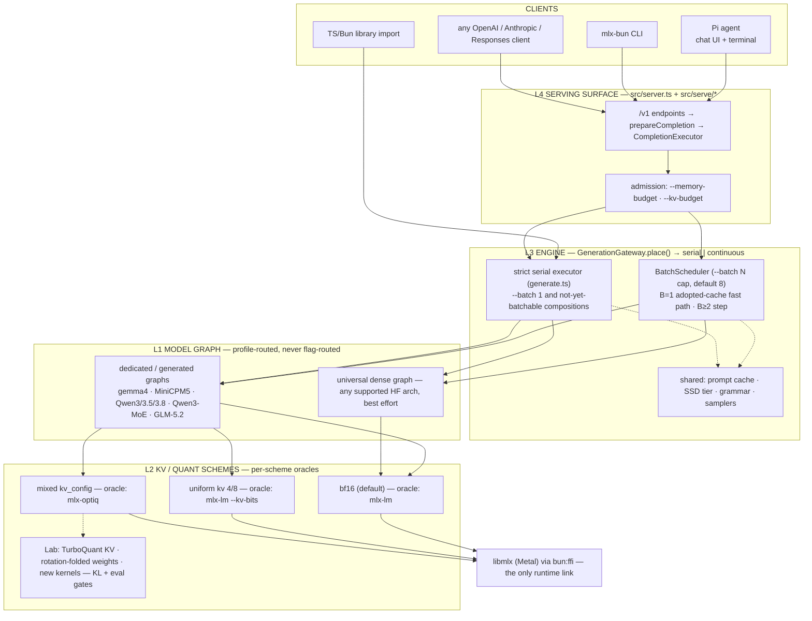
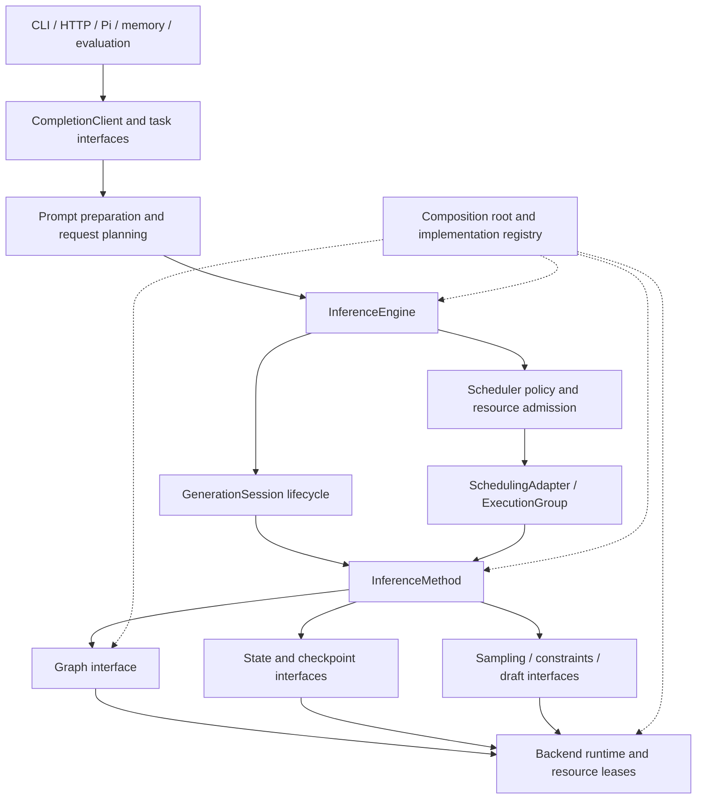

# Engine architecture — four layers, per-scheme oracles, one request path

This is the canonical architecture doc for mlx-bun's engine. It owns:

- the **four layers** (L1 graph / L2 KV+quant schemes / L3 engine / L4 surface)
  and the rule that features decompose along them;
- the **fidelity tiers** — L1 = mlx-lm bit-exact, L2 = mlx-optiq bit-exact,
  Lab = no-oracle experiments gated by KL/eval and a paired A/B before any
  default — and the decision procedure that places every optimization;
- the **naked default IS L1** decision (2026-07-05);
- the **engine** decision that concurrency is the batch size;
- the **request path** as it exists in `src/` today, the single-path rule, and
  the known deviations from it;
- the **flag end-state** and how it maps onto the layers.

The v2 refactor is in [§12](#12-interface-based-engine-refactor).
Josh requested replaceable implementations behind interfaces on 2026-09-04.
That section defines the target and migration, with implementation status below.
The new contracts are internal; existing public APIs remain the supported surface.
Earlier sections retain the current architecture and numerical contracts.
`last-verified` above dates the earlier inventory, not a whole-document reaudit.

Folded in (2026-08-23): `docs/design/unified-engine-frontier-plan.md` (tier framing, two axes, flag
classification) and `docs/archive/investigations/faithful-l1-consolidation.md` (the 2026-07-04 faithful→L1
consolidation and the 2026-07-05 deletion pass, now the History section).
Status and changelog prose lives in PLAN.md — see "Decision: naked default =
--l1; levers must beat the baseline (2026-07-05, Josh)" for the decision
record and "Serving architecture consolidation" for the live S0–S4 work. Every
`src/` claim below was re-read against the tree on 2026-08-23; where an older
draft of this doc disagreed with the code, the code wins and the note says so.

Companions: `docs/design/batching.md` (B=1 gap numbers), `docs/design/batching.md` and
`docs/design/batching.md` (scheduler mechanics — the mode-switch decision there is
superseded by §5), `docs/design/unified-engine-frontier-plan.md` (the S0–S3 seam),
`decode-speed-program.md` (the only doc that ranks speed levers; it also
carries the oMLX port ledger that used to be `docs/design/decode-speed-program.md`).

---

## 1. The two-part product and the contract

1. **A drop-in replacement for mlx-lm: everything they do, bit-exact.** This is
   the default. Parity is only *defined* over outputs mlx-lm can produce — you
   cannot ask for "mlx-lm's bits under mixed-precision KV" because mlx-lm
   cannot output anything under it.
2. **Beyond mlx-lm — features you opt into by deliberately trading the parity
   guarantee for something you value more**, each answering to its own oracle:
   mixed-precision KV (optiq), structured output (oMLX/xgrammar), speculative
   decoding (mlx-lm's `speculative_generate_step`; optiq for the KV-borrowing
   assistant drafter), prompt caching (mlx-lm's `LRUPromptCache`), prefix
   sharing and paged KV (vLLM/SGLang), multi-model switching (optiq
   per-request switching / oMLX EnginePool).

**THE CONTRACT (Josh, 2026-07-05) — two rules that compose:**

1. **The drop-in promise: the same BITS as mlx-lm.** How the bits are produced
   (storage, kernels, scheduling, engine, language) is the space we compete in.
2. **The oracle for anything is whoever already does that thing.** Want
   mlx-lm's decode → mlx-lm. optiq's mixed KV → optiq. vLLM's paged attention
   → vLLM: read their implementation, copy what they did, verify against them,
   then optimize. "No oracle" means *nobody* does the thing — genuine research
   — and that, and only that, is what the Lab is for.

Verification form follows the oracle's framework: same-libmlx oracles (mlx-lm,
optiq) admit bit-exact gates; cross-framework oracles (vLLM, CUDA/PyTorch)
anchor the algorithm and behavior while rule 1 still binds the output bits in
the default regime. "Faithful" kernel-set identity is the easiest route to
same-bits, not the contract; the one constraint bit-exactness puts on an
implementation is math/reduction order.

Two consequences drive everything below:

- **The baseline must be even and proven before optimizing.** The L1 path is
  bit-exact with mlx-lm and at decode parity on every model (PLAN.md, the
  2026-07-05 decision). Anything claiming to beat it proves it with a paired
  A/B on a stable pass; otherwise it is noise or a regression.
- **Frontier-shifting work is usually a quality-per-byte play, not a raw kernel
  play.** Mixed-precision quantization (weights and KV) moves memory down while
  holding or raising intelligence. Quantized KV stays first-class even though
  it lost the speed A/B: it buys context headroom.

The frontier axes we measure: memory (generation peak, fit-model), decode
tok/s (paired h2h, stable cells), prefill/TTFT, batched aggregate throughput,
and intelligence (the frozen eval suite in evals.sqlite). Curated numbers live
in `docs/reference/benchmarks.md`.

## 2. The four layers



### Layer responsibilities (the contract)

1. **Model graph (L1)** — one forward step given hidden + caches; attention
   dispatches on the *cache type it is handed* (bf16 → `ops.sdpa`, quantized →
   the quantized SDPA); shape-generic in B; selected by model profile, never by
   flags. *Responsibility: the numerics of a step, for any B, for whatever
   cache it is given.* The contract ENDS AT LOGITS.
2. **KV scheme (L2, cache classes)** — the memory format and its semantics:
   bf16 / uniform / mixed per-layer / TurboQuant; conversion timing (bf16
   prefill → quantize populated rows, optiq's hook semantics); in batched form
   the multi-row layout (padding, per-row rope, merge/extract/extend/filter).
   *Responsibility: the scheme PER ROW — a row's bytes and math identical solo
   or batched. This is where each scheme's oracle binds.* In code: `KvScheme`
   (`src/kv-scheme.ts`, kinds `bf16 | affine-uniform | affine-config | turbo`),
   the cache classes in `src/model/gemma4-base.ts`, and the batched variants in
   `src/model/batched-*.ts`.
3. **Engine (L3, scheduler)** — rows: admission, solo prefill, join/merge, the
   step loop, per-row sampling, eviction, pipelining, the concurrency cap.
   Never implements scheme math; calls layer-2 operations. *Responsibility: how
   many rows and when — never what a row's bytes mean.* In code:
   `src/serve/generation-gateway.ts` (placement + the single mutual-exclusion
   domain), `src/serve/batch-scheduler.ts`, `src/generate.ts` (the strict
   serial loop), `src/spec/serve-loop.ts` (the verify loop).
4. **Serving surface (L4)** — endpoints, per-request features (adapters,
   grammar, sampling, spec policy), prompt cache (keyed by fingerprint +
   effective scheme + adapter), admission budgets. *Responsibility: requests,
   not tensors.* In code: `src/server.ts`, `src/serve/request-plan.ts`,
   `src/serve/completion-executor.ts`, `src/serve/completion-sink.ts`.

### Model selection is a declared profile, not a flag

`resolveModelProfile()` (`src/model/profile.ts`) freezes, before construction,
the artifact/config identity, the fidelity target, the required engine
capabilities, and the loader/graph/loop composition. Exact artifact profiles
outrank family profiles; dedicated/generated graphs outrank the universal dense
fallback; an exact profile whose config or capabilities mismatch refuses
instead of downgrading. Profiles declare construction only — they cannot
rewrite MTP, KV scheme, adapters, grammar, or sampling (those are request
methods resolved independently). Promotion universal → dedicated is a
checklist: custom graph file, bit-exact goldens vs the scheme oracle, an h2h
entry at ≥1.00× vs mlx-lm on a stable pass, eval-suite rows recorded.

Note: `profile.ts` keeps `FidelityTier = "l1" | "l2" | "l3"`, where `l3` means
`oracle: null, claim: "measured"` — the Lab, named by its old letter. There is
no `--l3` on the CLI (it hard-errors; §7).

### Features decompose ALONG the layers

Per-request LoRA is the worked example: L1 = the math (`Wx + scale·B(Ax)`,
oracle-gated vs mlx-lm's tuner); L3 = the policy (which rows run which
adapter; today one active adapter per batch, and adapter requests run on the
serial mechanism); L4 = the surface (`adapter` field, mount/hot-swap,
discovery); plus one sideways obligation — KV under adapter A ≠ base KV, so the
prompt cache keys by adapter namespace (`cacheNs` in `runGeneration`). When
placing a feature, name its component at each layer and each component's gate.

### Sampling's placement and the debranching invariant

Sampling is *specified* at L4 (request params → a per-row `StepSampler`,
`src/sampler.ts`) and *executed* at L3 (each step, on each row's `[1,V]`
slice; vectorized when all-greedy) — it never enters L1. Everything
per-request-variable is either POST-GRAPH (sampling, grammar masks, stop
logic) or DATA the fixed graph consumes (adapter weights, caches). This is
what keeps the generated graph a straight line. Debranching backlog, still
open: the generated gemma files carry per-token runtime checks (`L > 1 &&
fusedSdpaRuntimeOk(q, mask)` in `src/model/generated/gemma4-*.ts`) that are
per-generation-decidable and should be hoisted out of the token path; compiled
decode already achieves the debranched line dynamically (trace once, replay).

### Layer 0 — the SSD spill substrate

It is almost always faster to cache to SSD and mmap it back than to
regenerate, and spilling lets RAM be a cache instead of the only tier. Three
implementations prove it: the SSD KV cold tier (`src/ssd-cache.ts`, a
`ColdTier` inside `PromptCache.take()` so both mechanisms restore prefixes
from disk at admission), MoE expert offload (page-aligned mmap), and the
byte-capped prompt cache. Decision: one generic substrate — content-addressed
keys (fingerprint + scheme + adapter + producer version), zero-copy mmap
restore, byte-capped LRU, corruption self-quarantine — that layers 1/2/4
consume. Future clients: vision encoder features, compiled grammars,
quantization results, TurboQuant artifacts. Economics (Josh): the SSD
competes with RECOMPUTE, not RAM — a long agent context is minutes of prefill
vs about a second of NVMe restore, and the ratio grows with context.

### The option surface IS the four layers

Users adjust: (1) how the model graph works — profile, compiled decode; (2)
how quantization works — weight bpw, KV scheme, TurboQuant; (3) how the
scheduler works — concurrency cap, KV budget, drafting policy; (4) the serving
surface — endpoints, adapters, structured output, sampling defaults, caches,
multi-model. Flags, help text, and reference docs should be arranged in these
four groups (§7).

## 3. Fidelity: per-scheme oracles, two axes, one decision procedure

The tier ladder is not a product mode. It is a **map from numeric scheme to
its verification oracle**:

| scheme | oracle | verification |
|---|---|---|
| bf16 (default), any batch B | **mlx-lm** at the same composition | bit-exact goldens (serial + B=2) |
| uniform kv 4/8 | **mlx-lm** `--kv-bits` (+ optiq's rotating cache class where upstream is NYI) | bit-exact (`kv-quant` tests) — `quantizedSdpaUnfused` is op-for-op mlx-lm's `quantized_scaled_dot_product_attention` |
| mixed per-layer kv (`kv_config.json`) | **mlx-optiq** `install_mixed_kv` | bit-exact (`mixed-kv-parity` test; batched rows per-row vs the serial oracle) |
| TurboQuant KV, rotation-folded weights, mixed-bpw weights, original kernels, batch-invariant kernels | **none exists** → Lab gates | KL vs our own reference path + frozen eval suite + envelope tests + kill switch |

`--l1`/`--l2` therefore name the first three rows' oracles. Mixed-precision
quantization is NOT demoted by the naked-=-L1 decision — it is the flagship of
the row that mlx-lm cannot oracle.

### The two axes (parity gates performance)

Every optimization has two independent coordinates, and conflating them is
what made the flag surface unreadable:

1. **Parity** — which reference does it reproduce bit-for-bit? This sets the
   *lowest* tier it may live in: matches mlx-lm → L1; matches optiq but not
   mlx-lm → L2; matches neither → no oracle, Lab-gated.
2. **Performance** — is it the fastest correct way? This sets whether it is
   the **default (on)** within its tier or a kept-but-off opt-in.

**Parity gates performance.** A faster kernel that breaks mlx-lm parity is not
"a faster L1" — it bubbles up to whatever tier its parity allows, and the user
opts in. An *optimization* that still matches the oracle stays low:
compiled decode is ours but is L1 because it replays the same ops bit-for-bit.
Only nodes with no oracle are forced into the Lab.

### Decision procedure for any new optimization

1. **Measure its parity** (run both ways, compare — one flag, one measurement
   per lever). The lowest oracle it matches bit-for-bit is its tier ceiling.
2. **Measure its performance** vs that tier's current default on a stable
   pass:
   - faster AND holds the guarantee → becomes the **default (on)** for the tier;
   - slower but still correct → a documented **default-off kill switch**
     (useful for A/B; never the default);
   - breaks the guarantee but offers a real trade-off → a **Lab item**
     (env flag, bench script, expiry); earns a default only by beating the L1
     baseline in a paired A/B (+ KL PASS if output-changing).

Worked: *5% less memory, still bit-for-bit* → default-on in L1. *2× tok/s at
KL 0.0015* → Lab item. *Another way, 3% slower, still correct* → kept, off.

### Composition rule: a composition inherits its scheme's oracle

Batching, prompt cache, spec decode, adapters — none change a scheme's
numerics, so composing them with a scheme verifies against THAT scheme's
oracle, per row. Batched bf16 anchors to mlx-lm B=N goldens; batched mixed-KV
anchors to optiq's per-row mechanics (our serial `maybeQuantizeKv` is the
verified op-for-op copy) and gates on per-row bit-exactness of the unpadded
row plus a calibrated envelope for padded rows (their noise is pre-existing
bf16 reduction order under grid snapping, measured at the pinned join step).
Do NOT invent Lab-style KL/teacher-forced gates for a composition of an
oracle-backed scheme; the Lab is only for schemes with no oracle at all.

### Flag classification (from the tier framing)

A flag falls into exactly one of three buckets:

| flag selects… | tier effect | what it IS | action |
|---|---|---|---|
| the only viable route | — | not a choice | always-on default; no flag |
| between two routes at the same tier / same oracle | none | a kill switch (A/B, debugging) | default the fast one; keep the slow one documented |
| between an oracle-backed route and a no-oracle route | tier ↔ Lab | a real parity ⇄ optimization knob | keep, document as such, group by layer |

Training flags classify the same way (verified in `src/cli.ts` train help):
`--grad-clip` is an always-on guard; `--seg N` / `--no-segment` is a
memory↔compute knob, bit-exact either way; `--grad-accum` and `--lambda` are
training-quality/hyperparameter knobs; `--no-flash` (flash-CCE head → the
MLX fused head) and `--no-prefix` (prefix-shared forward → two-forward) are
the only true parity ⇄ optimization toggles on that surface. The 2026-06-21
"parity-tier DAG" HTML map that motivated this classification
(`docs/dag/training-inference-map.html`) no longer exists in the tree; the
roadmap it proposed — derive the graph from code, CI-enforce "an L1-tagged
node has a passing bit-exact test", shrink the no-oracle surface, generate the
flag surface from the graph — remains an idea, not a phase.

### Lab lifecycle rule (the anti-flag-pile law)

Every Lab experiment ships with (a) a hypothesis in frontier-axis terms, (b) a
paired A/B bench script, (c) an expiry review date. Outcomes: promote to
default (with stable-pass numbers) or delete (with a breadcrumb in the design
doc). No third state. "Off in every regime with no promotion path" is a
deletion that hasn't happened yet.

## 4. Decision: the naked default IS L1 (2026-07-05, Josh)

The 2026-07-05 h2h pass showed the L1 kernel set at decode parity with mlx-lm
on every model while every output-changing lever failed to beat it in a paired
A/B, and quantized KV measured slower than bf16 at ≤16k on both stacks (it
buys memory headroom only). The record with numbers is PLAN.md "Decision:
naked default = --l1".

- **Naked = `--l1`.** `applyDecodeRoute` (`src/cli.ts`) defaults the tier to
  `l1`: bf16 KV, compiled decode on, compiled activations on, fused SDPA off.
- **Prior perf-optimization work is untrusted until re-proven** from this
  baseline (the losers were deleted the same day — §11 History).
- **The bar for any lever to earn a default back:** a paired A/B win vs L1 on
  a stable pass (no `unstable` tag), plus KL PASS if output-changing.
- **Explicit `--kv-quant` picks its oracle's composition**: `config` → optiq's
  fused prefill SDPA + stock unfused decode (the L2 golden composition);
  uniform `4|8` → unfused (mlx-lm's algorithm, L1-eligible); `turbo[:k.v.]` →
  dequantize-on-fetch through stock `ops.sdpa` (Lab). `--fused-sdpa` still
  overrides either.
- **`--l1`/`--l2` are pure aliases.** Each expands to a fixed set of per-fork
  values (`TIERS` in `applyDecodeRoute`), installed through
  `configureRuntime()` into the immutable runtime snapshot before model modules
  load; a per-fork flag overrides one value. Two invariants: a user can
  reproduce any tier byte-for-byte from individual flags, and no preset may set
  anything that isn't also an individual flag.

## 5. The engine: concurrency IS the batch size

**Decision (Josh, 2026-07-05): batching is determined by how many concurrent
requests are in flight, not by a flag.** One request = a lone row at serial
speed; N requests = continuous batching; rows join and leave running batches.
This reversed `docs/design/batching.md`'s "`--batch N` is a mode switch" decision.
The old objection — "an idle vs loaded server produces different numerics for
the same request" — gets a real answer:

1. **The L1 oracle itself behaves this way.** `mlx_lm.server` auto-batches;
   "drop-in for mlx-lm" *requires* concurrency-driven batching. The parity
   contract is **bit-exact to mlx-lm at the same batch composition**.
2. Anyone who needs load-independent numerics pins `--batch 1`.
3. **Batch-invariant kernels** (identical numerics regardless of B) are a Lab
   research item; if they land, determinism-under-load returns for free.

**The flag stays `--batch`** (no rename); its semantics are the cap on
concurrent rows (`--decode-concurrency` is accepted as the mlx_lm.server
alias). **Default 8** (`serverOptions.batch ?? 8` in `src/server.ts` and
`src/cli.ts`) — optiq's Mac-safe concurrency default and the 4–8-sub-agent
workload, superseding the earlier 32. `--batch 1` pins the strict serial
executor. An older draft of this doc and its diagram said 32; the code says 8.

**The workload this is for**: a user's agent harness pointing sub-agents at
one local server. Serial, the Nth agent's first token waits for N−1 full
generations; batched, every agent starts instantly and the fleet's wall-clock
collapses. Consequences: concurrency-driven batching (sub-agents don't
coordinate arrivals), prefix sharing gains priority (shared system prompts),
per-slot adapters, and batching × quantized KV first (long contexts).
"Single-user" in this project means single user, many agents.

### The B=1 fast path (the crux gate, met)

The unified engine could not replace the serial lane until a lone request
through the scheduler matched serial decode speed and bits. mlx-lm's own
`BatchGenerator` at B=1 runs within a few percent of its `stream_generate`
(paired A/B, PLAN.md), so the design was proven achievable; our gap was an
implementation artifact, closed in two moves (both are now design contracts,
§8): readbacks in a pipelined loop must not create ops, and a lone row keeps
bare serial-class caches so the step dispatches the same graph the serial loop
builds. Today `BatchScheduler` runs, for `B === 1 && unpadded && supports(inners)`
with a uint32 pipeline register, the serial engine's `CompiledDecode` step
(adopt-don't-copy: a row joining an empty batch keeps its solo caches as the
inners; the merge copy runs only when a second row actually joins). The
recorded scheduler/serial paired decode ratios are 0.992–0.996 (PLAN.md
"Serving architecture consolidation"), and `GATE-B1-PARITY` (bit-exact vs the
L1 goldens through the scheduler) is green on the curated probes.

### Composition is the product

Every serving capability is a STACKABLE layer on one engine — never a
lane-routing condition, never mutually exclusive. The matrix the engine must
satisfy, with the state of `GenerationGateway.#supportsContinuous` as read on
2026-08-23:

| layer | today (src) | end state |
|---|---|---|
| dedicated per-model graph | both mechanisms (profile-routed) | unchanged |
| mixed-precision KV (`affine-config`) | continuous when every configured layer is a plain or rotating KVCache the scheme can convert (`KvScheme.batchable` + the gateway's cache probe); uniform `kvBits`, SSM-layer configs, and TurboQuant route serial | one active scheme per server, any B |
| LoRA adapters | serial only (`shape.hasAdapters`) | per-slot adapter state (vLLM Punica/SGMV pattern: every row runs the adapter math, non-adapter rows at scale 0) |
| speculative decoding (two-model · assistant · dspark · deepspec · native MTP · ngram) | serial only; a mounted draft routes every request serial (`shape.hasDraft`, mlx_lm.server's `is_batchable = draft is None`); GLM-5.2 MTP is on by default and pins the serial verify lane (`--mtp off` restores batching) | per-slot drafting behind the `DraftSource` seam |
| structured output (grammar) | both (per-row matchers; `MLX_BUN_GRAMMAR_BATCH=0` forces serial) | unchanged; keep the conformance gate |
| sampling (temp/top-p/top-k/min-p/XTC/penalties/HLG/seed) | per-row `StepSampler` batches, including repetition penalty and logits extras; a user-fixed `seed` forces serial (mlx-lm's `_is_batchable`) | fully per-row, seeds included |
| logprobs capture | serial only (`shape.wantsLogprobs`) | per-row readback in the scheduler |
| vision / audio media prompts | serial only (`shape.hasVision`; embeddings-prefill bypasses the prompt cache) | batched media prefill |
| prompt cache / SSD tier | both: scheduler joiners `take()` the longest usable prefix at admission, never-merged rows `put()` back on finish; the cold tier restores inside `take()` | block-granular sharing across rows |
| paged KV (`--paged-kv`) | serial only, Gemma4 bf16, refuses `--batch N>1`, `--kv-quant`, `--draft-model`; bypasses the prompt cache | block-level CoW prefix sharing (vLLM oracle) |

Ordering of the remaining rows (by value): adapters per slot, then spec per
slot, then logprobs, then chunked prefill interleaving (vLLM policy) so a long
prefill doesn't stall running streams. `scripts/bench-matrix.ts modes` is the
composition scoreboard — every layer added to the scheduler gets a cell and a
parity gate.

## 6. Request path today

Modules in order, as read in `src/` on 2026-08-30:

1. **The request pipeline** (`src/serve/`). A request is data; each stage
   is one program with a declared input and output, composed in order by
   `src/server.ts` (which otherwise only assembles the server — KV scheme,
   prompt cache + SSD tier, gateway, admission — and dispatches routes):
   `new ChatRequest(body)` (`chat-request.ts`; validation at construction,
   mlx-lm's 400 messages) → `ChatStage.run` (`chat-stage.ts`; template render
   + prompt ids, media embeddings by family, grammar, adapters, sampling
   defaults via `request-prep.ts`) → `InferenceRequest` (`inference-request.ts`)
   → `InferenceStage.admit` (memory ceiling → reject or clamp; seals the plan)
   → `InferenceStage.run` → `InferenceResult` → wire. `/v1/completions` is
   `TextCompletionStage` into the same inference stage; `/v1/messages` and
   `/v1/responses` reuse `ChatStage` and format the result themselves. One
   JSON/SSE writer (`http.ts`) serves every surface; the protocol object
   (`openai-wire.ts`, `src/anthropic.ts`, `src/responses.ts`) is the only
   thing that differs.
2. **`src/serve/completion-executor.ts` `prepareCompletion()`** → **`src/serve/request-plan.ts` `planRequest()`** — admission (memory budget → reject or clamp `maxTokens`), capture options, adapter selection, and the `RequestShape` are derived ONCE for chat and raw-text, streaming and non-streaming. The result is an opaque, single-use `PreparedCompletion`; adapters cannot inspect or rewrite the plan. Owned resources (media arrays, grammar) dispose on rejection.
3. **`CompletionExecutor.execute()`** — owns one completion attempt: asks the engine for placement, records the lane (`src/serve/lane-registry.ts`), builds the `CompletionSink` (semantic events: content / reasoning / tool calls / stop), collects logprobs, transfers resource ownership exactly once, runs, and settles the terminal summary (finish reason, usage, cached tokens, final lane, speculation stats). Adapters only format that summary.
4. **`src/serve/generation-gateway.ts` `GenerationGateway.place(shape)`** — freezes one `GenerationPlacement { shape, mechanism: "serial" | "continuous" }`. `#supportsContinuous` is a capability check only (§5 matrix); it never rewrites MTP, KV scheme, TurboQuant, grammar, adapters, or sampling. `run()` rejects a placement made for another shape. One `AsyncMutex` is the single mutual-exclusion domain: a serial run holds it; the scheduler holds it for its whole active period; a waiting serial request drains the batch (mlx-lm's `drain_batch`).
5. **`continuous` →** `src/serve/batch-scheduler.ts` — admission under `--kv-budget`, chunked interleaved solo prefill, join/merge/extend/filter over per-layer cache types, the pipelined step loop, per-row `StepSampler`, eviction. B=1 takes the adopted-cache fast path (§5). **`serial` →** `runGeneration` in `src/server.ts` → `src/generate.ts` (prompt-cache take/put, snapshot boundary, the chunked prefill, the pipelined compiled decode loop) or, when a draft is mounted and the request is spec-eligible, `src/spec/serve-loop.ts`.

**The single-path rule.** Options are *declarations* carried through
placement, never forks above the scheduler. A request's resolved settings
(KV scheme, TurboQuant, drafting, grammar, adapters, sampling) are authoritative
from `planRequest` onward; `place()` may only answer "does the continuous
mechanism implement exactly this composition?" — it may not substitute a
cheaper composition to make a request batchable (the optiq bug class: silently
serving bf16 under a quantized scheme). The scheduler independently refuses a
scheme it cannot execute at construction, and `KvScheme` freezes its per-layer
entries so a caller cannot mutate conversion or accounting after resolution.

**Known deviations from the single-path rule (verified 2026-08-23):**

1. **Two prefill loops.** `src/generate.ts` (the chunk loop with the
   `snapshotAt` split, the mlx-lm tail-split convention
   `min(prefillChunkSize, remaining-1)`, per-chunk `clearCache`) and
   `BatchScheduler.#prefillChunk` in `src/serve/batch-scheduler.ts` (the same
   conventions re-implemented over `PrefillState` for interleaved admission).
   Both are gated bit-exact, but a convention change must land in two places.
2. **Spec eligibility is decided after placement.** `planRequest` only knows
   `hasDraft = !!ctx.draft` (server-level), which routes every request serial
   while a draft is mounted. The real per-request eligibility — text-only, no
   adapters, no logprobs capture, bf16 KV (no `kvBits`/`kvConfig`/`turboQuant`),
   not paged — is evaluated inside `runGeneration` after `place()`; ineligible
   requests silently fall through to plain serial decode, and the lane label is
   corrected from `serial+spec` to `serial` only when `stats.spec` is absent
   (`finalLane` in the executor). Resolving this means lifting the eligibility
   predicate into `RequestShape` so placement and the lane label are decided
   once.

Other seams worth knowing: `runGeneration` also decides the prompt-cache
bypass (media, paged) and the adapter cache namespace; `--isolate` wraps the
ENTIRE server as an engine child behind a proxy (`src/serve/isolate.ts`,
`ModelPool` for `--model-pool` LRU residency and model switching by the
request's `model` field) — the inter-process API is the /v1 surface itself, no
second protocol.

## 7. The flag surface (src truth, grouped by layer)

Read from `SERVER_FLAGS` and `applyDecodeRoute` in `src/cli.ts`. Every
`MLX_BUN_*` value is read through the immutable runtime snapshot
(`src/runtime-config.ts` `runtimeValue/runtimeFlag`, `src/flags.ts` `flagOn`);
feature code never reads `process.env`, and the CLI installs tier/fork
overrides with `configureRuntime()` before model modules load.

**Parity tier (aliases):** `--l1` (default) · `--l2`. `--l3` hard-errors with a
pointer to this doc.

**L2 — quantization:** `--kv-quant config|off|4|8|turbo[:k<bits>v<bits>]`
(default off). An older draft of this doc listed only `config|4|8|off`; the
`turbo` axis is real and mutually exclusive with the affine modes.

**L3 — scheduler / decode policy:** `--batch <n>` (default 8;
`--decode-concurrency` alias) · `--kv-budget <GB>` · `--draft-model <query>` ·
`--draft-kind two-model|assistant|dspark|deepspec|mtp|ngram` ·
`--num-draft-tokens` · `--ngram-max` / `--ngram-min` · `--mtp on|off`
(GLM-5.2 native MTP, on by default) · `--context-length` (GLM-5.2 reservation)
· `--paged-kv` / `--paged-kv-block-size` (env `MLX_BUN_PAGED_KV=1`).

**L4 — serving surface:** `--model` · `--host` · `--port` · `--memory-budget`
· `--prompt-cache <GB>` · `--ssd-cache <dir>` · `--ssd-cache-max` ·
`--ssd-demote-idle` · `--ssd-cache-verify` · `--isolate` · `--model-pool` ·
`--unix` (internal) · `--no-open` · `--allow-private-media` · `--adapter`
(`--adapter-path` alias) · `--thinking` · `--temperature`/`--temp` · `--top-p`
· `--top-k` · `--max-tokens` · the HLG sampler family (`--hlg-sampling`,
`--hlg-width`, `--hlg-shoulder`, `--hlg-toe`, `--hlg-pivot-offset`).

**Kill switches (bit-exact A/B levers, each selects a slower same-parity
path):** `--compiled-decode on|off` (`MLX_BUN_COMPILED_DECODE`) ·
`--compiled-activations on|off` (`MLX_BUN_COMPILED_GEGLU` +
`MLX_BUN_COMPILED_SWIGLU`; only gemma geglu and MiniCPM5 swiglu have an
uncompiled form — qwen3/qwen3.5/universal compile unconditionally) ·
`--fused-sdpa on|off` (`MLX_BUN_NO_FUSED_SDPA`, inverted; default follows
`--kv-quant`) · `--force-wire` (`MLX_BUN_FORCE_WIRE`) · `--expert-offload`
(`MLX_BUN_EXPERT_OFFLOAD`). An older draft said these were env-only; the three
decode kill switches are CLI flags as well.

**Lab / diagnostic env flags (no CLI flag; live with a bench and an expiry):**
`MLX_BUN_GRAMMAR_JUMP=1` (jump-forward decoding, serial non-spec loop),
`MLX_BUN_GRAMMAR_BATCH=0` (grammar back to serial), `MLX_BUN_BATCH_SSM=0`
(SSM caches back to serial), `MLX_BUN_BATCH_NO_PIPELINE`,
`MLX_BUN_BATCH_STEP_TRACE`, `MLX_BUN_BATCH_VEC_SAMPLE`, `MLX_BUN_BATCH_EXTEND`,
`MLX_BUN_PREFILL_TAIL_SPLIT`, `MLX_BUN_FLASH_MIN_M`, the `MLX_BUN_CCE_*`
training-kernel switches, and the memory/trace loggers. Anything
output-changing is Lab by definition.

**Deleted (2026-07-05, §11):** `--fused-decode`, `--fused-gelu`,
`--perf-kernel`, `--l3`, and their env twins. None exist in `src/`.

## 8. Design invariants proven en route (durable, not changelog)

- **Readbacks in a pipelined loop must not create ops.** `toFloat32()` on the
  int token array enqueued a cast BEHIND the next dispatched step, stalling the
  "overlapped" read a full GPU step per token. Use `MlxArray.toIntTokens()`.
- **A lone row keeps bare serial-class caches.** `KVCache.makeMask(1)` is the
  empty mask and scalar rope; the batched step then dispatches the same graph
  the serial loop builds. The per-layer `BatchedDecodeMaskCache` wrapper is
  only for padded batches.
- **Rope-array step-stability contract.** A batched cache's `ropeOffsetArr`
  must be stable within a decode step and refresh only at `releaseRopeArr()`;
  re-reading it mid-update ropes K and Q one position apart.
- **Generated-file guards accept batched subclasses.** The generated forwards'
  per-layer `instanceof` guards pass any batched cache that subclasses a
  serial class, so an all-quant gemma batch decodes through the generated
  fast path — a feature (B=1 proved bit-exact) but a contract: batched caches
  must behave serially under re-reads. Test with FULL configs; one bf16 layer
  anywhere fails the guard and drops to the monolith.
- **Quantization packs along HEAD_DIM**, so token-axis batch surgery over
  (packed, scales, biases) triples is byte-safe; solo rows convert at serial
  chunk boundaries (bit-exact by construction).
- **A scheme-less path must refuse, never silently drop quantization.** The
  gateway only threads a `KvScheme` to the scheduler when it is batchable; the
  scheduler refuses an unsupported scheme at construction.
- **Prefix sharing is non-consuming.** `PromptCache.take()` serves zero-copy
  clones (ref-counted retain so a demoted donor never unmaps pages a clone
  reads); the donor stays put; `put()` supersedes same-namespace prefix
  ancestors when the new entry is trimmable. Kills the cannibalization flaw
  (agent B consuming agent A's entry). v1 shares COMPUTE and durability;
  concurrent rows still hold separate physical KV — one shared physical prefix
  across rows is the block-KV frontier item, and whole-entry duplication in
  the disk tier is the block-granularity revisit trigger.
- **Prompt-boundary snapshot.** The prompt+generation entry is untrimmable
  past a wrapped ring or under quantized KV, so every substantial request also
  snapshots a strict prompt prefix (cap `len-1`), the mlx-lm
  `insert_segments` invariant; a re-rendered next turn always matches.
- **Never a JS callback as an mlx buffer destructor** — last-ref `Data` dtors
  run on the Metal completion thread (native `dlsym(free)` dtor, process-pinned
  mmaps).
- **Isolation proxies the whole server**, not the gateway: grammar WASM,
  vision arrays, and sampler closures don't serialize; the /v1 surface is the
  IPC.

## 9. The frontier program (order matters)

Ranked by expected frontier shift (memory ↓ / intelligence ↑ first, then
speed). Each item is a Lab program with its own doc; `decode-speed-program.md`
ranks the speed levers and is the only doc that does.

1. **Mixed-precision weights** — knapsack `--target-bpw` (ours; OptiQ-style
   sensitivity port in `src/quantize/sensitivity.ts`) and rotation-folded
   quantization (`docs/design/turboquant.md`, `--rotate-weights`). Gate:
   perplexity + frozen 6-task eval at equal bpw.
2. **TurboQuant KV** (`docs/design/turboquant.md`, landed v1) — orthogonal to
   allocation: mixed precision is the ALLOCATION axis, TurboQuant the
   QUANTIZER axis; they compose. Solo-only in v1.
3. **Speculative decoding depth** — DFlash/DSpark, native MTP, behind the
   `DraftSource` seam (`docs/design/speculative-decoding.md`).
4. **Per-model graph work from the baseline** — unroll a model's flat DAG,
   find fusion the compiler misses, prove with kernel-trace diffs, promote per
   model.
5. **Batch-invariant kernels** (research) — restores determinism under load.

## 10. Decisions log and open items

1. **Cap default 8** — flipped 2026-07-05 after the B=1 gates; `--batch 1`
   pins arrival-independent numerics; kv-budget admission keeps 8 safe on
   small boxes.
2. **Flag stays `--batch`**; semantics = cap.
3. **Perf kernel deleted**; a future flash-decode kernel re-derives from the L1
   baseline in the Lab — no resurrection.
4. **`--l1`/`--l2` remain user-facing CLI aliases** (`src/cli.ts` documents
   them under "Parity tier"). The 2026-07-05 intent that they become
   bench/test vocabulary only has not been executed; if it is, `serve --help`,
   `docs/reference/cli.md`, and `server-config.md` change in the same commit.
5. **Block-paged KV**: an optional serial-only v1 exists (`--paged-kv`,
   `docs/design/kv-cache.md`); padded-batch waste removal and block CoW prefix
   sharing are its follow-ups, triggered when prefix sharing under batching
   becomes the bottleneck.
6. **Prefix sharing scope**: must extend to the disk tier; first-class cases
   are new-session spin-up and server restart — the shared prefix is a durable
   object, not a property of one conversation's entry.
7. **Open composition rows** (§5): adapters, spec, logprobs, media on the
   continuous mechanism; chunked prefill interleaving as policy.
8. **Open single-path deviations** (§6): unify the prefill loops; move
   prompt/media/grammar construction behind the seam; lift spec eligibility
   into `RequestShape`.
9. **Debranching backlog** (§2): hoist the generated files' per-token
   `L > 1 && fusedSdpaRuntimeOk` checks.

## 11. History

**2026-07-04 — faithful → L1 consolidation.** An audit found three
overlapping "match mlx-lm" mechanisms that disagreed: the `--l1/--l2/--l3`
tier presets, an `MLX_BUN_FAITHFUL` preset that forced the gemma monolith and
set choices no flag could reach, and a family of unwired `Faithful*` model
subclasses. The decisive rule that collapsed them: **"compiled" kernels
(`@mx.compile` geglu/swiglu, compiled decode) go through the same libmlx as
mlx-lm → bit-exact and faster → L1 defaults; custom "fused" Metal kernels were
mlx-bun originals with a proven residual → not bit-exact.** Landed in four
phases: compiled activations default-on everywhere (qwen3, qwen3.5, universal
dense, gemma geglu via `MLX_BUN_COMPILED_GEGLU`, MiniCPM5 swiglu), verified
`maxDiff === 0` vs mlx-lm; `--compiled-activations` and `--fused-gelu` added as
per-fork flags so `--l1` became a pure alias; `MLX_BUN_FAITHFUL`, `faithful.ts`
(→ `flags.ts`, only `flagOn` kept), and the four unwired subclasses deleted;
docs + the "cost of removing each faithful kernel" bench matrix. The only
family that had it right from the start was `qwen3_moe`: the production class
IS the faithful port. Bit-exact-to-mlx-lm *wants* compiled activations (mlx-lm
`@mx.compile`s them), so the earlier `--l1` "unfused" help text was backwards.

**2026-07-05 — the Phase-1 deletion pass** (same day as the naked-=-L1
decision; ~50 files touched, 23 deleted, suite green). Josh: "we will end up
redoing all the work we have currently done given that we now have a different
starting point." Deleted, one funeral each:

- `--fused-decode` / `MLX_BUN_FUSED_DECODE` — 1.00×, forced uncompiled decode,
  a silent-wrongness footgun.
- `--fused-gelu` / `MLX_BUN_FUSED_GELU` and `MLX_BUN_FUSED_SWIGLU` (+
  `fused-mlp-kernel.ts`, `steel-linear-kernel.ts`, the swiglu/geglu/steel
  one-off scripts) — +0–1%; the compiled closures already own the fusion win
  bit-exactly.
- `--perf-kernel` / `MLX_BUN_PERF_KERNEL` (the fused online-softmax decode
  SDPA) with its frozen-oracle scaffolding (`perf-kernel-oracle.test.ts`,
  `freeze-perf-oracle.ts`) — regressed e4b in the paired A/B; its one win
  carried a KL WARN. Its earlier placement in the L2 preset (commit `f1bf5cc`)
  had claimed a bit-exact optiq oracle; the golden was frozen from mlx-bun's
  own engine and the gate was argmax agreement, so 2026-07-01 had already
  restored the rule that the bare tier is the guarantee.
- `MLX_BUN_CPM5_FAITHFUL` + `FaithfulMiniCPM5` (`minicpm5-faithful.ts`) — the
  default IS the faithful path; the op-for-op A/B reference served its purpose
  (it is how the unfused-swiglu dispatch tax was found).
- `--l3` as a product mode — the Lab replaces it; the flag hard-errors.
- Training-side flag sanitization (`MLX_BUN_PERF_KERNEL=0` /
  `MLX_BUN_FUSED_GELU=0` in trainers, launchers, recipes) — obsolete.

**2026-07-05 — engine unification** (Phases 0–3.2 of the original migration
plan; numbers in PLAN.md): the B=1 batch-lane gap measured, root-caused to the
two host bugs in §8, closed; batched mixed-KV for full-attention and rotating
layers; adopt-don't-copy + compiled decode at B=1 + prompt cache on the batch
lane; SSD tier moved inside `PromptCache.take()`; non-consuming prefix sharing;
`--isolate` P1 (proxy) and P2 (`ModelPool`, multi-model switching); `--batch`
default 8.

**2026-08-21 — serving architecture consolidation S0–S3** (live in PLAN.md):
`PreparedCompletion` + `CompletionExecutor` (S0), immutable
`GenerationPlacement` (S1), declared model profiles (S2), `serial | continuous`
as the placement vocabulary with the scheduler's B=1 fast path as the default
lone-request route (S3). S4 (land + post-merge verify) is the open box.

## 12. Interface-based engine refactor

Design requested 2026-09-04. Initial implementation is recorded in §12.13. The R0–R10
checkboxes live in PLAN.md under "Interface-based engine refactor". This
section owns the contracts, migration details, and acceptance criteria.

### 12.1 Outcome and scope

The product objective is to push the Pareto frontier of **speed, quality, and
size for local AI on a Mac**. Josh's goal is that a user sees the result and
asks how that quality, performance, and model size are possible on their
laptop. Interface consistency is useful when it makes those gains easier to
build, compare, compose, and ship. It is not an independent reason to accept
slower execution or a larger working set.

The current target is **Josh's designated Qwen3.8-27B quants**. They are on a
drive unavailable to this session. Artifact access is needed for target-specific
numerical and performance validation; it does not block the refactor.
The locally cached published flagship and TQ snapshots are not those targets
(Josh clarified this on 2026-09-04); availability must not select the product
baseline. Quant recipes and quality findings remain in [TurboQuant](turboquant.md),
including rejected variants and raw-EOS regressions. Interfaces must preserve
exact packing, rotation, per-layer precision, recurrent-state, and kernel
choices. Other artifacts/families provide compatibility coverage only.

A downloaded quant supplies weights, configuration, and tokenizer data. The
engine owns the hyperoptimized implementations and the rules for identifying
which quant each one supports. Resolve artifact identity and configuration at
load time, select registered engine code, then retain that binding for execution.
The quant does not supply a graph, kernel, method, plugin, or executable manifest.
An unknown artifact may use a compatible family implementation. An exact
declaration with missing code or incompatible configuration must fail explicitly.
Sessions remain independent of the selected implementation.

Aggressive specialization for a particular quantization is expected. A
quant-specific layout, graph, fused kernel, cache scheme, compiled schedule,
or complete execution method is a legitimate production implementation.
Several specialized implementations can be worth maintaining when each wins
in a useful regime. Shared orchestration must not force the fastest numerical
implementation through an inefficient generic operator path.

A session must work without knowing the model class, graph implementation,
decoding algorithm, cache layout, or scheduling mechanism. Every replaceable
component exposes an interface. Immutable configuration, events, and results
remain data records; implementations keep private helpers private.

There are three distinct replacement operations:

| Replacement | Integration change | What must remain compatible |
|---|---|---|
| Dedicated graph → generated, compiled, or quant-specialized graph | Replace one graph registration in a model bundle | Graph ABI, backend, input/output shapes, state ABI, numerical contract |
| Autoregressive → speculative or diffusion method | Select a method registration and its compatible graph bundle | Session lifecycle, committed-output events, cancellation, accounting |
| MLX implementation → another runtime | Register a complete backend bundle with its graphs, state, sampling, and resource services | Engine/session contracts; a numerical claim requires separate evidence |

The first operation must require no session, scheduler-policy, route, or
application changes. The second must require no method-specific session or
protocol branches. A different numerical runtime cannot reuse MLX tensor
handles merely because the TypeScript interface matches.

Preserve the existing APIs and numerical defaults during migration. A new
internal interface does not implicitly expand supported feature combinations.
Keep one repository and the single-binary distribution. Remote compute, new
model families, a universal tensor library, a generic graph compiler, and true
B-wide prefill are separate projects. Training gets its own task interface;
it does not pretend to be a text-generation session.

This scope boundary does not defer quant-specific optimization. The refactor
must accommodate the existing quantization campaign and future optimized
implementations throughout migration. New numerical work has separate paired
validation, so structural changes cannot conceal a quality or performance
tradeoff. §12.11 defines the shared frontier scorecard.

### 12.2 Dependency structure



Interfaces belong to the consumer's contract layer. Composition roots import
implementations and supply them explicitly. No service locator inside a token
loop, import-time self-registration, dependency injection framework, or
reflection-based constructor discovery is needed.

Proposed homes, introduced only as their migration phase lands:

| Home | Responsibility and permitted dependencies |
|---|---|
| `src/contracts/` | Portable requests, events, results, session/client/task interfaces. No Bun, DOM, MLX, concrete model, or application imports. |
| `src/engine/` | Session lifecycle, planner, scheduler policy, admission. Depends on contracts and injected ports. |
| `src/inference/` | Method and graph contracts; reusable AR orchestration, verification, and scheduling adapters. Tensor-facing code is parameterized by a backend binding. |
| `src/backends/mlx/` | MLX runtime, typed bindings, resource owners, execution groups, state adapters. Wrap existing numerics before relocating files. |
| `src/model/` | Existing model math behind graph adapters, artifact profiles, loaders. Concrete implementations may use MLX internally. |
| `src/serve/` | Protocol parsing/framing and transport; calls the completion client. No concrete graph selection or cache surgery. |
| `src/app/` | Composition roots, runtime bootstrap, server/application assembly. The intentional location for concrete imports. |
| Existing application directories | Memory, Pi, web, eval, train, quantize consume their declared client/task ports. Move root modules only when their dependencies have been separated. |

Use TypeScript projects plus an AST/import-resolution boundary check. The check
must follow type-only imports, re-exports, aliases, and literal dynamic imports.
New forbidden edges fail; temporary legacy edges have a named R-phase owner and
a deletion gate. Browser contracts cannot import declarations out of pi-web.ts.
No new concrete model checks in engine/session/planner code. Model-specific
checks remain legitimate inside the model's own adapter.

### 12.3 Interface inventory

These are responsibility boundaries, not a mandate for one class per row.
Small stateless ports may be implemented by functions or object literals.

| Interface | Owns | Must not own |
|---|---|---|
| `CompletionClient` | Semantic completion request, event stream, terminal result, cancellation | Tensor/state handles, model class selection |
| `PromptPreparer` | Template/tokenizer policy, token IDs, validated media descriptors, stable-prefix boundary | GPU scheduling or request-global model mutation |
| `ExecutionPlanner` | Effective immutable policy, implementation selection, capability negotiation, fallback reasons, plan identity | Starting generation or inventing new feature support |
| `InferenceEngine` | Session creation, runtime coordination, shutdown | Per-family forward math |
| `GenerationSession` | Lifecycle, committed output, result, cancellation and close | Token-at-a-time assumption, KV offsets, concrete method branches |
| `InferenceMethod` | AR/speculative/diffusion algorithm and private per-run state | HTTP framing or application sessions |
| `SchedulingAdapter` / `ExecutionGroup` | Method-specific join/leave and bounded execution work | Queue priority policy or independent memory admission |
| `Scheduler` | Fairness, active-row cap, queue limits, safe-point dispatch | Cache merge math, sampler math, model-family checks |
| `ModelBundle` / `GraphFactory` | Artifact construction, graph selection, compatible backend/state services | Rewriting requested sampling or KV policy |
| `AutoregressiveGraph` | Forward-to-hidden and selective logits projection | Token selection, prefill loop, stopping, persistence |
| `DenoisingGraph` | Canvas/noise-step operations required by diffusion | Pretend AR cache or fake next-token API |
| `SpecializedExecutionFactory` | Quant/artifact/device-specific fused execution behind the same method/group contract | Changing quality policy or observable session semantics without a declared plan |
| `SamplingPolicy` / `SamplingKernel` | Shared processor/mask/logprob/sample/history semantics and backend execution | Transport, independent request defaults |
| `ConstraintProvider` / `DraftProvider` | Per-run constraint state or proposals under declared capabilities | Mutating target model fields outside a bound context |
| `StateFactory` and capability facets | Owned state, borrowing, snapshots, batch operations, rollback where supported | Assuming every state is trimmable token KV |
| `PrefixStore` / `CheckpointStore` | Lookup, retention, integrity, atomic persistence and version checks | Reconstructing arbitrary concrete cache classes itself |
| `ResourceManager` / `ResourceLease` | Reservations, backing memory lifetime, device completion, release | Model math or hiding synchronization |
| `ArtifactResolver` / `TokenizerProvider` | Pinned artifact identity, tokenizer/template provenance and loading | Request execution |
| `TelemetrySink` / `Clock` | Structured observations and time | Scheduling or output decisions |
| `EngineHost` / `TaskRunner` | Direct or isolated runtime lifecycle; train/quantize task execution | Sending live tensor handles across a process boundary |

Existing `CompletionExecutor`, `CompletionSink`, `DraftProvider`, `DraftSource`,
model profiles, `KvScheme`, and the cache codec table are starting points.
Adapt or evolve them; do not retain a second permanent wrapper hierarchy.

### 12.4 Session and graph contracts

Illustrative signatures below fix the intended separation. Supporting record
types are specified by the semantics in this section and finalized in R1.
They are not implemented public exports yet.

```ts
interface InferenceEngine {
  open(request: GenerationRequest, control: RunControl): Promise<GenerationSession>;
  close(): Promise<void>;
}

interface GenerationSession {
  readonly id: string;
  readonly events: AsyncIterable<GenerationEvent>;
  readonly result: Promise<GenerationOutcome>;
  cancel(reason: CancelReason): Promise<void>;
  close(): Promise<void>;
}

type GenerationEvent =
  | { type: "committed"; sequence: number; tokenIds: readonly number[] }
  | { type: "progress"; usage: UsageSnapshot };

interface InferenceMethod<Binding> {
  readonly descriptor: MethodDescriptor;
  createRun(plan: ExecutionPlan, binding: Binding): Promise<MethodRun<Binding>>;
}

// Tensor-facing contracts exist only inside a compatible backend bundle.
interface AutoregressiveGraph<Tensor, State, Inputs> {
  readonly descriptor: GraphDescriptor;
  forwardHidden(inputs: Inputs, state: State): Tensor;
  projectLogits(hidden: Tensor, selection: LogitSelection): Tensor;
}

interface GraphFactory<Graph, Binding> {
  readonly descriptor: GraphDescriptor;
  open(artifact: ResolvedArtifact, binding: Binding): Promise<Graph>;
}
```

`GenerationSession` is one completion attempt, distinct from a Pi conversation
or application thread. The engine coordinates independent sessions sharing a
resident model. The method's private run owns prompt position, sampler history,
pending device work, and caches/canvas; those do not become session fields.
`RunControl` uses a portable cancellation port; HTTP adapters translate their
AbortSignal into it. Contract declarations do not pull in browser/server modules.

All methods publish only irrevocably committed token spans. A span can contain
one token, an accepted speculative group, or a whole completed diffusion
result. Tentative diffusion canvas revisions and rejected draft tokens are
private. A non-streaming method may publish nothing until its final output.
The existing completion sink converts committed tokens to semantic text,
reasoning, tools, stops, and protocol usage. Tokenizer identity is fixed at
session open. Task types that cannot provide this token contract use a separate
task interface rather than fabricated tokens or usage.

Lifecycle is `created → preparing → queued → running → settling → terminal`.
Terminal outcome is exactly one of completed, cancelled, or failed. Each state
accepts cancellation. Early iterator return initiates cancellation. Only one
consumer may read events; progress observation cannot steal output. A bounded
queue propagates backpressure to scheduling between safe work units. Never
silently drop output or let a slow consumer retain unlimited device state.

`result` settles once on every path, including no consumer, worker death,
preparation failure, and cancellation. It contains a discriminated outcome
with final usage/error data. Events already emitted remain a partial result
on failure. GenerationRequest declares streaming or collecting consumption at
open. Streaming starts on demand and has a configured idle-consumer deadline;
an abandoned/unread stream cancels when that deadline expires. Collecting runs
without an event reader, reserves output storage against the admitted maximum,
and returns collected tokens with the outcome. Insufficient collection capacity
fails admission; it never silently truncates output. R1 fixes the queue/deadline
defaults with tests. Completed sessions reject further advancement;
cancel/close are idempotent. Close cancels live work and awaits safe release.

Graph calls remain direct device operations. The interface does not insert
an await, readback, tensor wrapper, or synchronization for each operator.
`forwardHidden` plus selective `projectLogits` preserves the existing ability
to avoid a full prompt-length × vocabulary logits allocation. Compile caches
belong to the implementation and key on the graph/state/request parameters
that affect their trace. A graph factory owns and closes resident weights;
individual runs borrow them through leases.

The selective-hidden/logits interface is the reusable AR path. A specialization
may instead implement a coarse execution contract that fuses graph, head,
sampling, or state updates and never materializes those intermediate tensors.
It must preserve the declared sampler/constraint semantics, accounting, safe
points, and resource ownership, and pass the same conformance suite. Do not
require a fused kernel to synthesize hidden/logits objects solely to satisfy
an abstraction. The planner binds this alternative once through the registry;
the session and scheduler policy remain unchanged.

R1 must specify graph ABI dimensions, dtypes, mutation rules, position/mask
inputs, output ownership, and evaluation semantics. Include media inputs,
hidden taps, and adapter bindings as typed graph capabilities. Move mRoPE,
adapter selection, and hidden taps out of mutable model-global request fields
into bound per-run contexts. While legacy models still mutate those fields,
their adapter requires the exclusive lease and restores them on every exit.

The registration bundle binds graph, tensor type, state factory, sampler,
device runtime, and optional capabilities together. Use generics and opaque
handles internally; do not erase them with `any` or public casts. Validate
backend ID, state ABI, graph ABI, and artifact identity at construction and
restore. TypeScript compatibility alone does not establish numerical parity.

Specialization keys may include exact artifact fingerprint, weight quant/layout
and packing version, layer/shape geometry, KV scheme, Mac GPU capabilities,
context regime, and batch regime. Dispatch is planned or bound at a safe shape
transition, with a validated compatible fallback outside the optimized range.
It must not become a collection of per-token environment checks. Fused paths
may retain optional features only when implemented; capability negotiation
selects another faithful implementation when the requested composition needs it.

### 12.5 Capability negotiation and planning

Replace scattered feature booleans with versioned capability descriptors and
typed capability interfaces. Obtain a complete optional facet once during
planning, such as rollback or batch join. The core never probes a handful of
optional methods and hopes they form a complete implementation.

Evaluate the whole composition: artifact/profile, graph, method, KV scheme,
sampler, seed, constraints, adapters, media, checkpointing, and batching.
Two independently supported features do not prove their combination works.
Each supported composition links to its conformance/oracle test cell.

Within a compatible composition, selection may use a measured execution recipe
for the artifact/quant/device/workload. A recipe binds the entire implementation
bundle, its quality contract, and resource model. It can choose a quant-specific
fused method rather than a generic graph. Record provenance and the evidence
behind automatic selection. Never optimize by changing the requested artifact,
quant, or quality tier without an explicitly permitted product policy.

Planning returns supported, refused, or an explicit policy-permitted fallback
with reasons. Distinguish required request behavior from preferred acceleration.
Retain existing intentional fallback behavior during migration and record it
in the plan. Never silently change a required scheme, constraint, seed, or
adapter to gain batching. Preserving existing support also means retaining
explicit refusals. Fallback ordering is deterministic and tested.

The plan contains artifact and tokenizer identities, implementation IDs/ABIs,
oracle tier, actual algorithm, resolved sampling/stop policy, state layout,
cache/checkpoint policy, resource estimates, and allowed execution shapes.
Dynamic batch membership is runtime state within those allowed shapes. Record
it in traces; do not freeze a future arrival schedule into admission.

Normalize environment/CLI/request configuration at the boundary. Capture an
immutable effective snapshot per engine/run. No runtime configuration lookups
inside forward/decode after binding. Experiment commands construct separate
bindings with explicit snapshots. Diagnostics may observe a running request
but cannot change its numeric policy halfway through execution.

Admission is two-stage: validate metadata and reserve a conservative preparation
budget before compiling grammar or running media towers; then refine the
reservation using prepared sizes before execution. Count shared resident
weights once, per-run state, draft resources, media/preparation transients,
compiled state, pending output, and retained snapshot/write-behind buffers.
Reservation ownership transfers across stages and releases on every failure.
Keep prompt/context clamping semantics and aggregate KV limits consistent with
current policy. A rejected prompt must not first allocate its full GPU payload.

### 12.6 State, ownership, and persistence

Resource rules apply to success, partial construction, eviction, cancellation,
rollback, shutdown, and native failure:

- A resource has one owner, with explicit borrowed views or retained leases.
  Ownership transfer is a checked operation; a resource cannot be disposed by
  both the old and new owner. Close is idempotent and attempts every release
  even if one cleanup fails, preserving the original execution error.
- Device handles and host/mmap backing memory have distinct lifetimes. A native
  completion fence governs final backing release. JS scope exit or array
  disposal alone is insufficient. Never restore a JS callback destructor on
  a Metal completion thread. Finalization remains a diagnostic/backstop.
- Replace `stateNeedsDispose` with an explicit owned state-view lease. Snapshot
  creation returns a stable owner; later writes to the donor cannot change it.
  Prefix lookup returns retained state and its exact logical coverage.
- State capability facets include snapshot, prefix reuse, trimming, batch
  merge/extract/filter, and speculative transaction. Recurrent state supports
  exact restore/replay where proven; diffusion state can expose a different
  snapshot without claiming a token prefix or trim operation.
- A speculative transaction includes every participating layer and draft-side
  state. Commit or rollback leaves one consistent accepted prefix. Partial
  failure invalidates the run; it cannot return uncertain state to PrefixStore.
- Storage policy is separate from layout codecs. Provider-owned codecs bind
  formats to a compatible implementation. Keep streamed tensor writes,
  corruption checks, atomic publication, byte caps, and bounded spill queues.
  Do not replace the current copy-restore with unsafe mmap borrowing for style.

Prefix identity and generation-resume identity are separate records. Prefix
identity covers artifact content, tokenizer/template interpretation, adapters
and their revisions, effective numeric scheme, graph/state compatibility, and
media content when reuse is supported. Generation identity additionally covers
the complete normalized request, stop strings, sampling/seed policy, method,
constraints, generation limit, and resume schema. Canonicalize map keys while
preserving semantically ordered arrays. Store the descriptor as well as its
digest, and validate it on restore.

A resume snapshot includes consumed input coverage, committed completion count,
pending token/device work in a restorable form, RNG/history position, and any
method/constraint state needed for exact continuation. Physical cache offset,
committed output, and bytes delivered to a client are different quantities.
Snapshots are legal only at declared safe points. Unsupported exact-resume
compositions remain refused or disabled as documented.

Retries must distinguish a new generation from a resumed attempt. Preserve the
current replay contract through its compatibility adapter; explicitly design
any future idempotency/resume field before changing the public API. Never claim
exactly-once delivery across a broken stream or automatically replay tool side
effects. Cold-prefix misses may recompute; an incompatible exact-resume request
must report the mismatch rather than invent a continuation. Version the format
and define read-old/write-new compatibility or explicit invalidation per change.

### 12.7 Scheduling and inference methods

Keep policy independent from mechanics. Scheduler chooses eligible work,
fairness, queue bounds, active-row limits, and resource reservations. A method's
scheduling adapter creates execution groups and implements join/leave/advance
over its own state. Native batch merge and filter stay inside the MLX adapter.
Scheduler must not import KV classes or perform a per-layer tensor loop.

An advancement is a bounded safe unit, not necessarily a token: one prefill
chunk, a pipelined decode step, one verify round, or one denoising iteration.
Budgets describe admitted resources and work hints separately. A synchronous
kernel cannot be interrupted; cancellation is honored at the next safe point.
Keep pending MLX work between advancements to preserve decode overlap. No
mandatory GPU synchronize or full logits readback at the scheduling boundary.

An execution group owns its resident run handles exclusively. Join/leave
validates compatibility before state mutation. Group-wide failure either
proves unaffected rows safe or fails the entire group; it cannot publish
possibly corrupted snapshots. Slow readers stop receiving dispatch while their
reservations remain accounted for; cancellation releases them after pending
device work is safe. Queued cancellation removes the waiter promptly so a dead
serial request cannot keep batch admission in drain mode.

Migrate these existing algorithms behind the contracts:

| Method/component | Preserved behavior |
|---|---|
| AR method | Shared prefill program, existing tail split/snapshot boundaries, sampler order, pending-token pipeline |
| Speculative method | Existing verifier and DraftSource variants, actual proposal length, target taps, per-step RNG, recurrent rollback, source-specific prefill convention |
| Fill/grammar acceleration | Explicit assert/verify proposal policy and constraint state; preserve current exclusions and fidelity gates |
| Diffusion method | Existing denoising behavior with private canvas state and committed output only; no fabricated AR state |
| Continuous execution adapter | B=1 adopted-cache path; existing merge/extract/filter operations and per-row sampler history |
| Quant-specific execution | Fused or precompiled work units with the same observable semantics and explicit numerical tier; no forced intermediate allocations |

Shared AR prefill does not imply full-prompt forwarding for every method.
Native GLM MTP already declares a different prefill convention. Preserve it as
data in the method plan. Likewise, unifying solo prefill code does not establish
bit identity with B-wide prefill or broaden the batch support matrix.

The shared prefill program is the canonical policy for segmentation, snapshots,
and cancellation. A measured specialization can execute that program through
a different kernel schedule while satisfying its numerical and resource
contract. Share the decisions; do not prohibit a faster executor merely because
its implementation cannot reuse a helper function.

### 12.8 Applications, library, and process boundaries

Keep the existing token-to-semantic completion pipeline. `CompletionClient`
is the application/transport boundary; `GenerationSession` is the worker's
method-neutral token boundary. An ordinary OpenAI-compatible remote endpoint
can implement CompletionClient without exposing token IDs or local checkpoints.
It cannot masquerade as a fully capable local GenerationSession.

Provide direct and isolated CompletionClient/EngineHost implementations. Evolve
the existing `src/serve/isolate.ts` EngineChild, ModelPool, health gating,
restart policy, and HTTP-over-Unix-socket proxy. Isolation already exists.
Do not build a competing supervisor or change the wire protocol merely to
match internal interfaces. Current whole-server isolation remains supported
while CPU application services are separated from worker-owned compute.

Worker requests contain portable policy and media descriptors/bytes. Grammar
controllers, media tensors, sampler closures, state handles, and device leases
are created in the worker. A crash fails in-flight completion attempts, resets
worker-owned residency, and preserves parent health/application state. Existing
GET/HEAD retry behavior does not authorize automatic generation POST replay.
Cross-process resume requires the explicit checkpoint/replay contract above.

One resource coordinator covers inference and managed training/quantization
jobs that share a runtime host. Preserve the existing jobs subprocess design
and persist terminal job state. Do not describe this coordinator as controlling
unrelated external Python processes or a separately launched training run.

The high-level library opens a runtime asynchronously before importing/loading
native implementations. Root high-level imports must work without installed
MLX. Keep advanced native/model access in explicit low-level exports with clear
ownership and bootstrap requirements. Compatibility wrappers preserve current
exports until a deliberate versioned removal; they may not maintain duplicate
generation loops. Validate the packaged binary and native sidecars, not only
source execution, before release.

### 12.9 Current-to-target migration map

| Current code | Target and removal condition |
|---|---|
| `src/server.ts` runGeneration | Method/cache orchestration moves to inference/engine services; server retains composition and route dispatch |
| `src/generate.ts` | Compatibility entry around the AR method/session; one shared prefill and pending-token implementation |
| `src/serve/batch-scheduler.ts` | Split queue policy from MLX execution-group mechanics; delete duplicate prefill after parity gates |
| `src/serve/generation-gateway.ts` | Planner plus scheduling/resource coordination; remove late feature eligibility and concrete model probes |
| `src/serve/{request-plan,completion-executor,completion-sink}.ts` | Evolve into the request/session boundary and semantic adapter; retain tested accounting/framing behavior |
| `src/model/{factory,profile}.ts` and concrete graph files | Model bundle registration and graph adapters; replace the central concrete RuntimeModel union in generic consumers |
| `src/model/gemma4-base.ts` cache classes | Shared state contracts leave the Gemma module; implementations remain behind MLX state adapters until moved independently |
| `src/{prompt-cache,kv-store,ssd-cache}.ts` | Prefix/checkpoint policies use provider codecs and explicit retained snapshots |
| `src/{runtime-config,mlx/array,mlx/ffi}.ts` | Bound immutable configuration, explicit runtime opening, native resource owners |
| `src/spec/` and `src/fill/` | Typed method/draft/constraint capabilities; existing algorithms and oracle fixtures retained |
| `src/pi-web.ts`, Pi provider files, `src/web/src/` | Shared portable protocol declarations, client adapters, one provider-wiring implementation |
| `src/memory/`, `src/eval/`, `src/train/`, `src/quantize/`, `src/jobs/` | Completion/task clients and explicit artifact/resource services; preserve task-specific semantics |
| `src/serve/isolate.ts`, `src/index.ts`, `src/cli.ts` | Host/client adapters and composition roots; async high-level bootstrap and compatibility exports |

File moves follow responsibility extraction. Every temporary adapter has a
deletion criterion. Do not combine renames, numerical rewrites, and protocol
changes in one patch. Preserve failure reproduction fixtures through migration.

### 12.10 Implementation stages and dependencies

Each stage is one or more reviewable PRs. No calendar promise is made before R0
establishes the fixture and machine prerequisites. Checkboxes are in PLAN.md.

**R0. Stabilize and record the baseline.** Pin the compiler and align local/CI
typechecks. Reproduce and fix checkpoint stop-policy identity and serial
cancellation with targeted tests. Diagnose the recorded Qwen cache-reuse crash
before migrating its state implementation. Record exact revisions, existing
support/refusal cells, public defaults, ABI/schema versions, and resource
ownership. Capture quiet-machine baselines using existing bench tooling.
Structural refactoring and model-free validation proceed while target artifacts,
quiet hardware, or crash diagnosis are unavailable. Preserve existing numerical
and state behavior; changing the affected state implementation or promoting a
default still requires its relevant correctness and performance gates.
Exit: fixes independently verified, baseline manifest available, missing
machine/oracle cells explicitly listed. No unverified previous-review claim
becomes a passing gate merely by entering this plan.

**R1. Land contracts and prove method independence.** Depends on R0's inventory.
Create portable interfaces and dependency checks. Implement scripted AR-like
and final-output-only fake methods with different private state. Run the exact
same session lifecycle suite against both, including cancellation, failure,
backpressure, no-consumer behavior, and close. Introduce a legacy adapter around
the current executor so existing APIs still run. Exit: engine/session modules
import no concrete graph/native module; switching fake methods edits registration
only. Finalize the illustrative signatures through these executable contracts.

**R2. Bind real graphs and backend capabilities.** Depends on R1. Wrap existing
models with GraphFactory/ModelBundle bindings, beginning with one dedicated
graph and its existing generated counterpart. Bind sampler/state/runtime types,
resource estimates, artifact profile, media inputs, taps, and adapter context.
Exit: both real graphs run through the same method/session without consumer
edits; direct forward logits match their pinned oracle; backend/state mismatch
fails before allocation. Keep old models reachable through adapters until their
family-specific tests have migrated.

Also adapt an existing quant-specific path through its bundle and verify that
the interface adds no obligatory dequantization, tensor copy, intermediate
allocation, or synchronization. Validate the coarse fused-execution contract
before standardizing the reusable graph ABI.

**R3. Establish resource and state ownership.** Depends on R2 and the relevant
R0 crash fix. Introduce explicit state views, retained snapshots, device-backed
leases, and complete rollback facets. Evolve the codec table into provider-bound
codecs. Validate prefix and resume identities, including stop policy and adapter
revision. Exit: injected failures release all owners; donor/clone isolation,
ring wrap, recurrent rollback, cold restore, and restart fixtures pass. No new
GC-dependent lifetime or unsafe mmap release is accepted.

**R4. Resolve plans and reservations once.** Depends on R1–R3. Move speculation,
fill, compilation, cache bypass, and capability selection into one planner.
Use exact resolved plan data for execution, metrics, and checkpoint identity.
Move native media/constraint allocation behind preparation admission. Capture
configuration per binding. Exit: table-driven tests cover every shipped
composition and refusal; lane reports agree before/after execution; engine code
does not reread mutable global configuration. Existing fallbacks stay explicit.

**R5. Share AR prefill and session execution.** Depends on R2–R4. Extract a
step-able prefill program preserving chunk/eval/quantization/snapshot/final-token
order. Route serial execution and current solo batch-prefill through it. Move
pending-token, history, and checkpoint-safe-point state into the AR method run.
Thread cancellation through queue, preparation, prefill, and decode. Exit:
duplicate prefill loops are removed, phase-specific abort tests release the
lease, and cold/warm/restored logits plus streamed results match the baseline.
This is the Maintainability prefill item; Phase 18 S1a remains separate.

**R6. Adapt other methods and extensions.** Depends on R3–R5. Move the existing
speculative verifier and all retained DraftSource implementations behind typed
target views. Adapt fill/grammar acceleration and diffusion without expanding
their support. Exit: the same session suite passes for each; accepted/rejected
trace, pending-token accounting, stop handling, and recurrent rollback match
their method oracle. No session branch identifies AR/spec/diffusion by name.

**R7. Separate scheduler policy from batch execution.** Depends on R5–R6.
Move merge/extract/filter and B=1 adoption into execution groups. Centralize
fairness, drain policy, queue bounds, reservations, and cancellation. Exit:
dynamic join/leave, uneven rows, slow consumers, group failure, mixed-KV,
recurrent state, and ring-wrap cells pass wherever supported; unsupported
compositions retain their recorded placement/refusal. Preserve pipeline overlap.
Do not merge true B-wide prefill or new concurrency features into this stage.

**R8. Move applications onto client/task interfaces.** Depends on R1 and R4;
runtime cutover follows R5–R7. Separate shared web/Pi protocol declarations,
consolidate Pi provider configuration, and route memory/eval through clients.
Train/quantize retain task ports and dedicated numerical graphs. Add async
high-level library bootstrap and compatibility exports. Exit: CPU-only clients
and high-level package imports need no MLX; API/CLI/UI fixtures preserve current
behavior; task progress/cancellation and artifact semantics remain intact.

**R9. Adapt isolation and resource coordination.** Depends on R7–R8. Implement
EngineHost over existing isolation/model-pool code, separate parent application
state from worker compute, and coordinate managed GPU jobs. Exit: worker startup
failure, death mid-stream, bounded restart, model eviction, disconnect, and
shutdown tests pass; no automatic POST replay or native object serialization;
direct/isolated clients share the semantic contract. Compare transport overhead
before any default change. Existing `--isolate` behavior remains available.

**R10. Cut over, remove duplication, and close.** Depends on R0–R9. Default to
the new engine only after the full supported matrix and performance gates pass.
Delete legacy executor branches and temporary import exceptions. Review generated
twins, diffusion, curve/HLG, expert offload, paged KV, DSpark variants, compiled
decode, and Pi wiring using the existing D6 requirement: demonstrated use or
measured value, otherwise an explicit deletion decision. Retained experiments
register through declared interfaces. Update reference docs and package exports
in the same change as any public difference. Exit: replacement exercise below
passes, no duplicate engine remains, binary packaging works, and open-phase
blocks close without archiving this still-canonical architecture document.

### 12.11 Validation and release gates

**Contract tests on every PR.** Run without native MLX: scripted alternate
methods, lifecycle, ownership transfer, capability composition/refusal, stable
identity, queue fairness, resource accounting, event ordering/backpressure,
partial result/error behavior, and dependency boundaries. Add graph adapter
type-tests that reject incompatible backend/state bindings. Existing protocol
and UI tests remain their behavioral reference.

**Numerical and state matrix on available Apple Silicon machines.** Use the
pinned oracle and existing machine-layered goldens. Cover dedicated/generated
graphs, dense/MoE/recurrent/rotating state, bf16/uniform/mixed/TurboQuant where
supported, cold/warm/SSD/resume, B=1 and matching-B concurrent composition,
constraints, seeds, logprobs, adapters, media, speculation, and fill. Use targeted
pairwise cases plus every known failure reproduction; do not imply every
Cartesian combination is supported. Diffusion keeps its distinct oracle gate.
Exact cells remain exact. Existing tolerance cells require their recorded
justification; a refactor cannot loosen a gate to get green.

**Lifecycle sequences.** Exercise cancel before preparation, during admission,
between prefill chunks, after dispatch but before readback, during verify, during
checkpoint write, and on slow/broken streams. Check one terminal outcome and
eventual reservation release after device completion. Restore-and-continue must
equal uninterrupted execution for the exact supported resume policy. Test
incompatible/corrupt checkpoints and failed cleanup. Measure steady memory
after synchronization across repeated warm and aborted requests.

**Frontier scorecard.** Speed, quality, and size are independent axes. Keep a
Pareto set rather than collapsing them into one weighted score that hides a
regression. Every optimization names its target Mac memory budget, workload,
context, and concurrency before measurement.

| Axis | Required evidence |
|---|---|
| Speed | Short/long-context TTFT, sustained decode, inter-token latency, concurrent throughput; include startup/compile and cold/warm behavior separately |
| Quality | Oracle identity for unchanged numerics; for changed quants/numerics, KL as a screen plus frozen task evaluations, raw-prompt/EOS checks, and representative multi-turn agent/tool outcomes |
| Size | Actual artifact bytes and effective bpw including scales/codebooks/sidecars; peak unified-memory footprint at the declared context, including KV, draft model, workspaces and retained snapshots |
| Practical experience | Largest useful context that fits, responsiveness during long work, completion correctness, restart behavior, and a reproducible local task with visible user benefit |

A frontier improvement improves at least one axis without a meaningful loss on
the others at the declared measurement precision. A useful tradeoff can also be
a new non-dominated point; describe the lost/gained quantities explicitly and
apply the intended quality floor. A smaller model that causes an EOS/task
failure is not a quality-preserving win because its KL or aggregate benchmark
looked similar. Neither faster kernels alone nor smaller on-disk weights alone
establish a better product experience.

Compare to the best relevant measured recipe, including the current shipping
bundle and credible same-budget alternatives, not an intentionally weak
baseline. Publish artifact provenance, input corpus, evaluator, uncertainty,
machine and memory accounting. Keep training/tuning examples separate from the
held-out promotion set. Include ordinary laptop use and cold-start experience
in product evaluation while keeping quotable paired microbenchmarks quiet.

Optimization cycle: choose a bottleneck and target budget → propose a quant,
layout, graph/kernel or execution recipe → establish its numerical/quality
contract → measure the full scorecard → retain the non-dominated recipes →
register validated selectors for the appropriate Macs and workloads. Negative
findings belong in the topic doc; one-off research scripts are then removed.
The existing TurboQuant, decode-speed, KV and speculative programs own their
experiments. This architecture supplies the common registration and evaluation
contract without duplicating their backlogs.

Pure refactor PRs may be frontier-neutral. V2 product promotion requires at
least one reproducible frontier advance plus a representative local workload
that demonstrates the benefit. Until measured, it is an objective, not a claim.
Supporting multiple useful quant-specialized implementations is intentional;
remove duplicated lifecycle policy, not a demonstrated numerical advantage.

**Performance regression guard.** Record host/chip/RAM, revisions, artifact, effective plan,
concurrency, context, cache warmth and native runtime. Compare paired old/new
runs on the same quiet machine with existing tooling. Track startup, short/long
TTFT, inter-token latency, decode throughput, concurrent throughput/fairness,
peak memory, cancellation delay, and checkpoint stall. Predeclare a 3% median
regression investigation trigger for TTFT/decode on each representative cell, with
enough repetitions to distinguish it from noise; noisy results are unresolved.
Even smaller repeatable losses require a fix or an explicit measured benefit
elsewhere. No unexplained growing memory retention or disabled pipeline overlap.
The trigger prioritizes investigation; it is not an acceptable abstraction tax,
does not redefine a Pareto improvement, and does not permit quality degradation.
Report on both dev machines before final cutover; do not compare bits across
their different metallibs. Curated numbers go only in benchmarks.md.

**Replacement exercise.** Before closure, replace a real compatible graph with
another registered graph, run a quant-specific coarse/fused implementation
without adding session branches, then swap the method for a final-output-only test
implementation, then run the client through direct and isolated hosts. Session,
scheduler-policy, protocol, and application code must remain unchanged. Changes
belong only to the implementation/bundle registration and its tests. This is the
acceptance test for Josh's "swap one piece" requirement.

### 12.12 Rollout rules and remaining design decisions

Each stage routes a bounded set of existing configurations through a temporary
implementation selector in the composition root. Preserve the old implementation
only for paired comparison and rollback while that stage is open. Do not add
permanent user modes for intermediate architecture. Rollback selects a coherent
bundle and compatible persistence schema; never mix old graph state with a new
codec because both happen to implement an interface.

Decisions still requiring implementation evidence have explicit owners:

| Decision | Owner / decision gate |
|---|---|
| Exact event buffering and collect-mode limits | R1 contract tests; no-consumer and slow-consumer behavior must be bounded |
| Smallest graph ABI that covers existing taps/media/compiled paths | R2 real graph replacement plus per-family adapters |
| Fence/lease implementation and old checkpoint compatibility | R3 native lifetime tests and restore/restart fixtures |
| Which batch mechanics can share a method adapter | R7 parity and pipeline-overlap measurements |
| Whether finer worker separation should become a default | R9 crash containment, packaging, and transport measurements |
| Retirement of each experimental/duplicate implementation | R10 D6 usage or paired measurement; no deletion by interface preference |
| Which optimized recipe becomes the automatic choice for a Mac/workload | R10 full frontier scorecard and held-out quality gate; no universal winner assumed |

R0 fixes are small independent changes. R1–R4 establish and validate the
contracts. R5–R7 perform the execution migration. R8–R10 complete applications,
isolation, and deletion. Contract drafting must lead to the first real graph
replacement in R2; it cannot grow indefinitely without that working proof.

### 12.13 Implementation status (2026-09-05)

Branch: `refactor/interface-engine-v2`. The comparison baseline is
`6d45ca1e17e825c48af9b246a37486380117f640` (`origin/main`, fetched again
2026-09-05). Its reference docs and tests freeze the pre-refactor public
defaults, supported combinations and refusals; use `git show <revision>:<path>`
to inspect that baseline without consulting a moving branch.

| Baseline dimension | Frozen source / compatibility rule |
|---|---|
| Flags, defaults and routes | Baseline `docs/reference/{server-config,server-api,cli}.md`; no new architecture mode becomes a default in this phase |
| Families, quants and feature support | Baseline `docs/reference/models.md`, model profiles and parity tests; the locally available published Qwen artifacts supply compatibility evidence only |
| Native oracle and machine | Baseline `docs/reference/environment.md` plus its machine-layered golden manifests; all branch numerical comparisons reported here use the M1 Max 32 GB and the pinned venv |
| Toolchain | Bun 1.4.0 (`34cbb9a40`), TypeScript pinned to 6.0.3; Python MLX/Metal 0.31.2, mlx-lm 0.31.3, mlx-optiq 0.2.15 |
| Graph/state representation | Existing MLX hidden `[batch, positions, width]` and legacy cache arrays; newly declared `mlx-hidden-bsh-v1` / `legacy-cache-array-v1` describe those representations without converting them. Denoising uses its distinct `mlx-denoising-v1` graph ABI |
| Persistence | SSD prefix format 3 is retained; legacy codec identity remains readable. Generation resume identity advances from the baseline's unversioned policy hash to version 4, including stops, adapter content, implementation and resolved policy |
| Ownership | Resident weights remain borrowed; request caches, rollback scratch, native preparation and retained prefix backing release at their existing device-safe boundaries, now expressed through owners and leases |
| Performance | Baseline/candidate paired diagnostics exist for available artifacts; quiet-machine preflight did not pass, so none establishes a quotable regression result or frontier advance |

Outstanding evidence is explicit: Josh's designated quant artifacts, the M4 Pro
24 GB matrix, quiet paired performance, unavailable diffusion/drafter weights,
the Qwen 4B B=2/persistence oracle fixtures, and reconciliation of the reported
other-machine Metal-memory fix. The crash is diagnosed as a native allocation
failure; this branch preserves the affected cache math. These missing cells
do not prevent interface work and do prevent declaring the final cutover gate
passed.

R0 fixes pin TypeScript 6.0.3 for
local/CI checks, add stop strings and a version to generation-checkpoint
identity, remove cancelled serial waiters immediately, and check cancellation
between AR/spec target-prefill chunks and committed-token boundaries.

`src/contracts/generation.ts` defines portable planner, method/run, session,
output, result, cancellation, and timer ports. `src/engine/` implements lifecycle
and delivery without model or runtime imports. The dedicated TypeScript project
has ES2022 only and no ambient runtime types; an AST/resolved-import test also
checks type imports, re-exports, and dynamic imports against dependency layers.

Streaming starts on the first reader demand. Defaults are 32 queued events,
256 queued token IDs, 20 top-logprob entries per token, and a 30-second
idle-consumer deadline. Large committed spans split under backpressure.
Collecting reserves a Uint32 buffer before method creation, with an aggregate
65,536-token active-collection ceiling; terminal output ownership transfers to
the caller. Collection currently returns IDs only; logprobs require streaming.
Cancellation and early iterator return wait for run cleanup. Failure outcomes
retain the execution error if cleanup also fails. These are internal defaults,
not new server flags.

`src/backends/mlx/legacy-engine.ts` bridges already-resolved text requests into
the existing gateway. It snapshots request data before demand-start and keeps
placement, serialization, native cancellation, caches, and quant execution in
the existing implementation. Media, adapters, grammar, and caller-owned native
resources remain with the legacy completion executor; this bridge explicitly
refuses those requests. It is not the default HTTP path.

`src/inference/graph.ts` declares the backend-bound graph ABI.
`src/backends/mlx/graph.ts` binds synchronous/streamed forwards once and selects
hidden positions before vocabulary projection. `src/backends/mlx/autoregressive.ts`
defines one `MlxAutoregressiveBinding` for the graph, cache construction, media
forwarding, adapter state, memory accounting, and optional compiled/fused decode.
`generateAutoregressive()` consumes that interface without requiring a
`RuntimeModel`. The existing `generate()` API adapts AR models into it, preserving
the serial loop's sampling, prefill chunks, lazy evaluation, and decode pipeline.
No tensor wrapper, device readback, or synchronization was introduced.

Concrete Gemma compiled-decode selection and rollback-based fallback now live
in the legacy binding. A replacement supplies its own decoder; the loop never
infers one from the model family. A declined step must leave state unchanged.
Unrecovered errors propagate without retry. Bindings must declare the MLX
hidden-state ABI and legacy `Cache[]` ABI; mismatches fail before cache allocation.

The host now captures AR/denoising and speculative bindings once. Compiled
replay permission and grammar jumping are resolved alongside placement and
included in checkpoint identity. Serial execution consumes that policy; B=1
batch replay also honors it, with dynamic cache geometry still allowed to
decline replay transactionally. A lazily created batch group inherits the
gateway's runtime snapshot. Composition and snapshot tests cover later config
changes, adapters, paged/media fallback, speculation, denoising and logprobs.
Legacy kernel flag reads now resolve through an execution-local runtime snapshot.
AR/denoising generator resumes and cleanup, the speculative verifier and its
memory scope, and each batch driver retain that snapshot across awaits. A later
host configuration change cannot alter a running binding's kernel policy.
Nested/concurrent scope tests and native binding tests cover early close,
verification callbacks and lazy batch construction. The scope adds no tensor
copy, evaluation or device fence; its performance remains part of the paired gate.
Rejected initial state releases owned caches while preserving borrowed caches.
Decoder cleanup completes before cache disposal, including early iterator return.
If execution and decoder cleanup both fail, the aggregate retains both errors.
The legacy descriptor is not a persistence identity. Rich media remains a native
preparation input; tap capabilities and provider-bound persistence are described
below. A different cache ABI requires its own compatible method/backend binding.

Serial cache lookup, checkpoint replay/persistence and prompt-boundary snapshots
now live in `src/backends/mlx/serial-executor.ts`. The HTTP server injects a bound
generator/verifier, cache constructor, prefix/checkpoint stores, clone function
and adapter namespace service. Native Qwen media context is installed/restored
by its compatibility binder. The executor has no concrete model dispatch;
the existing gateway still owns scheduling and exclusive execution.

Model-free binding tests exercise an independent graph, a replacement fused
decoder, declined steps, unrecovered errors, and unsupported ABI/media/adapter
requests. The native `generated-parity` gate runs dedicated and generated Gemma
bindings through the same gateway method and portable session consumer. Tokens
and cache coverage match, and its counter verifies the generated path executed.
This is a compatibility gate using available weights, not a product speed claim.
The binding migration also passes all eight compiled-decode parity/recovery
checks and the Qwen3.8-27B TQ smoke below on the M1 Max 32 GB.

`src/model/implementation.ts` defines the backend-parameterized
`ModelImplementation` construction port and immutable registration table.
`ModelExecutionComposition.implementation` lets an exact engine-owned artifact
profile name its code. Existing identity/config guards perform the matching;
the registry does not introduce another artifact matcher. `src/model/factory.ts`
now registers the existing resident constructors, including generated Gemma,
and selects one before construction. `openModel` checks the binding before
opening weights; callers can compose profiles and implementations through its
options. `createModel` accepts a registry for already-open weights. No selection
is added to the token loop, and no model file format changes.

Unknown artifacts retain existing family selection. Missing implementations,
graph/loader/loop mismatches, duplicate IDs, and inconsistent exact identities
fail explicitly. Construction failures propagate without trying another graph.
Model-free tests exercise the factory with a synthetic exact quant identity and
an alternate constructor; this establishes selection, not numerical or speed
claims. No registration pretends to identify Josh's inaccessible quants.
This step covers resident graph construction. Colibri retains its existing
streamed opener and refuses named overrides until its loader binding exists.
The legacy runtime model union and method-specific paths still need the full
R2/R6 binding migration before arbitrary implementations can replace them.

Artifact-parameterized native smoke gate:
`MLX_BUN_QWEN_QUANT_PATH=/path/to/our/artifact bun test tests/parity/qwen-quant-engine.test.ts`.
Run one artifact per process. Compatibility-only checks on the M1 Max 32 GB
pass for the locally cached published `mjriii/Qwen3.8-27B` and
`mjriii/Qwen3.8-27B-TQ`: direct-versus-bound logits, legacy-versus-session greedy
output/cache coverage, and repeated recurrent-prefix borrowing. These are not
Josh's current target quants. Target validation awaits access to those artifacts;
implementation continues independently. The test is a bounded smoke, not a full model oracle or the
recorded turn-8 repro. Gemma compiled-decode checks are secondary coverage too.

R1 is complete. Incremental and final-only producers run the same lifecycle
cases for collection/streaming, blocked-consumer cancellation, partial failure,
and no-consumer/pre-cancelled settlement. Additional tests cover preparation
cancellation, admission refusal, metadata bounds, and cleanup failures.

R3 now gives request resources one checked owner. Transfer invalidates the
previous owner, close is idempotent even after a destructor failure, and cleanup
attempts all releases while preserving the original execution error. MLX state
views expose a lease; prefill and prefix-cache accounting close it without
knowing whether handles are borrowed or temporary. Only the compatibility
adapter reads the legacy ownership marker. No tensor copy, evaluation or device
synchronization is added by these leases. Fault-injection tests cover transfer,
partial view acquisition and throwing destructors. Existing native fences remain
in place; codec binding and persistence identity are described below.

R4 now resolves method, scheduling mechanism, paged-KV fallback, prompt-cache
bypass, fill eligibility and checkpoint eligibility in one portable planner.
The gateway passes that immutable decision to serial execution; lane accounting
uses the actual method, including AR fallback with a configured draft. Request
policy arrays/maps are copied and frozen at admission. AR runtime settings and
batch work flags use a binding snapshot. Native grammar/media preparation takes
the gateway execution lease before allocation; text rendering remains outside
that lease. Cancellation before/during preparation is covered with allocation
and cleanup assertions.

Checkpoint request identity is now canonical SHA-256 over sampling/stop policy,
resolved execution and the artifact/implementation/state ABI. Object insertion
order is ignored; array order remains meaningful. Version-4 keys include the
resolved compiled/grammar policy; version-2/3 generation keys do
not resume through this version; ordinary prefix-store format is unchanged.
Nine native scheduling gates pass after planner integration, including rotating
dynamic joins, row failure containment, serial drain, prefix sharing, SSD restore
and compiled B=1. Preparation reservations now remain owned through execution; see below.

R3 state persistence now uses `CacheCodecProvider`, bound through the server's
model context, RAM cloner, batch snapshots and SSD store. A provider supplies
clone/snapshot/restore/trimmability together; ambiguous matches refuse. Persisted
provider identity is checked before cache allocation or mmap. Earlier v3 files
implicitly use the legacy provider; a different provider must identify itself.
Restore still copies one tensor at a time and unmaps only after those copies,
so this change introduces no new device/backing lifetime assumption. Failed
clone and snapshot construction release intermediate owned views.

Adapter namespaces now hash the weight file plus scale/rank policy once at
mount. Remounting the same name with different bytes or scale cannot reuse its
old RAM prefix or generation checkpoint. The shared server cache uses that
namespace for both lookup and persistence. Codec provider fault/round-trip tests
pass; native persistence passes five cells with one unavailable golden skipped,
and dedicated/generated Gemma passes six cells, including direct logit identity.

R5 now shares a portable prefill program between serial AR and solo batch
admission. Its MLX executor preserves drain evaluation, KV maintenance, allocator
clears, stable-boundary snapshots, and the separate final-token forward. Batch
admission retains its short-tail scheduling behavior. Six native scheduler
checks pass, including dynamic rows, prompt reuse, SSD restore and compiled B=1;
the dedicated/generated same-session test also passes on the M1 Max 32 GB.
The native AR method run owns its generator's pending tokens, history and
checkpoint boundary. Phase-specific tests now cover cancellation before any
cache allocation, after a prefill chunk, after decode dispatch/before emission,
and while an asynchronous checkpoint borrows live state. Cancellation waits for
the checkpoint to finish before releasing state. Current-token logprob arrays
remain owned until readback succeeds, including forward/grammar failure;
cancelled execution stops before emission or a subsequent checkpoint write.

R6 now runs the speculative verifier through `MlxSpeculativeBinding`. Target
forwards, projection, tap capture, draft construction and kernel pinning bind
outside the verifier. Legacy tap contexts restore their previous value on exit.
The complete rollback facet validates recurrent begin/commit/replay together;
partial layer failures invalidate the transaction and the run discards its state.
Ring-capacity fallback retains its strict pre-write boundary. The verifier owns
input/hidden scratch on failure and attempts every final release.

AR and speculative methods now implement `InferenceMethod` directly. Their shared
host adapter translates cancellation and waits for native cleanup. The same
session tests exercise collection, streaming, early reader closure and forward
failure for both. Four native Qwen3.5-0.8B gates pass, including recurrent
rejections and identical speculative acceptance traces through a portable
session. This smaller available model supplies compatibility coverage only.
Denoising now implements that same method/session contract through a separate
`DenoisingGraph<Tensor, State>`. Its test binding uses a position-only state
record, with no AR cache or token-prefix API. The existing synchronous diffusion
entry and cooperative generation drain one denoising program. Cooperative calls
yield between denoising steps and publish only the final output; cancellation
releases canvas, feedback, embedding weights and graph state. Generation holds
the existing exclusive runtime lease, including the diffusion global RNG.

Scripted regression tests cover both samplers, RNG-dependent canvases across
multiple blocks, sync/async identity, preparation failure, cancellation between
steps and repeated-run native memory accounting. The existing soft-embedding
lifetime test passes. Diffusion weights are absent on this machine, so its
weight/oracle gates remain unrun. Draft sources now consume declared target
ports for assistant donor views/scaled embeddings, Gemma hidden taps/output
projection and Qwen MTP embeddings/output projection. The target view contains
no concrete model or cache array; the MLX compatibility binder owns family
checks and donor layout. Native GLM providers compare an opaque target identity
before borrowing their own model-owned weights. Both retained DSpark variants
use the projection interface. Missing extensions refuse before draft allocation.
An independent assistant target fixture proves construction and draft cleanup
without a model class; donor acquisition releases partial views on failure.
The locally cached published Qwen3.8-27B and its bundled MTP head pass the
same-artifact greedy comparison after this migration. This does not establish
performance or compatibility for Josh's unavailable exact quants.

R7 now separates the portable scheduling driver from `MlxBatchExecutionGroup`.
The driver sees queue/active counts, admission readiness and bounded work units;
it imports no model, cache, tensor or runtime implementation. Native admission,
merge/extract/filter, sampling and pipeline state live in `src/backends/mlx/`.
A compatibility re-export preserves existing batch-scheduler imports.

The driver retains short-admission grouping, long-prefill interleaving, serial
drain and the 25 ms single-row responsiveness budget. Six native scheduler
checks and two native failure-containment/serial-drain checks pass. Policy tests cover those ordering rules, execution failure and
lease release; backend fault tests cover a request removed from the queue when
admission fails, retained-prefix cleanup, shutdown and submission after close.
Closing a group stops at a safe boundary, rejects pending/active requests and
releases owned state. Bounded request and preparation queues now reject overflow explicitly. The full
mixed-state concurrency/performance matrix remains open.

R8 now shares Pi/browser messages, history, sampling data and route IDs in
`src/contracts/pi.ts`. Compatibility re-exports preserve server-side imports.
The browser TypeScript project has no Bun ambient types; Bun UI tests remain
covered by the root project. The resolved-import gate prevents browser modules
from importing server implementations, including type-only imports.

R4/R7 admission now uses a portable FIFO `AdmissionPool`. The gateway bounds
active requests and queued waiters; cancelled waiters do not release another
request's capacity. Media and grammar preparation reserve capacity before native
allocation. The request owner retains that reservation after transferring native
resources to execution, then releases it on success, failure or cancellation.
The direct batch group also bounds pending submissions. Overload is explicit in
the existing HTTP/SSE error contract. Nine native scheduling checks pass after
this integration, including rotating joins, failure containment, prefix/SSD reuse
and compiled B=1. The gateway's shared execution lease covers preparation,
generation and managed GPU jobs.

R8 is complete: completion/batch/task contracts are portable. Memory calls accept an injected
client; their existing native implementation moved behind a lazy backend import.
Eval generation accepts a replacement completion client and retains its separate
bit-exact greedy oracle path in the MLX backend. Training and quantization keep
their numerical runners and artifact results; both job execution modes now use
the task adapter. Progress delivery is synchronous and unbuffered; cooperative
cancellation checks before work and at progress boundaries. Native work already
dispatched still completes at its safe boundary.

Pi's embedded registry and generated extension use one model-definition builder.
Job and Pi/browser messages now share portable declarations. New `mlx-bun/engine`
and `mlx-bun/client` exports import without MLX; `initializeMlx()` explicitly
bootstraps the compatibility API. The existing root import remains compatible.
The JSON completion client uses either HTTP or an `EngineHost` without changing
callers, preserves abort, and never retries completion POSTs.

R9 adapts the existing `EngineChild` into `EngineHost`, bounds restart attempts,
cancels restart backoff on close, kills failed startup, and checks disconnect
while waiting for readiness. Model-pool startup failures and shutdown close their
owned children; an evicted default can be resolved again for an absent/unknown
model request. The fake-host proxy suite now runs in the model-free CI tier.
Real MiniCPM JSON and incremental SSE requests pass through the isolated host.

Managed GPU subprocess jobs reserve the same gateway lease as inference: the
current batch drains before spawn, and the job retains the lease through child
exit, including crashes. Host shutdown cancels admission/queued jobs and terminates
its active job before releasing the lease. Fault tests cover rejected admission,
spawn failure, child death and shutdown. The isolation parent now owns job/settings routes and their store. A portable
shared/exclusive coordinator covers every worker's startup, restart, response
body and eviction. Before GPU job spawn, live UDS lease responses reserve each
worker's gateway after durability flush; disconnect releases the worker lock.
Those connections remain owned through subprocess exit, not merely until a
client HTTP disconnect. Native MiniCPM checks verify that generation waits for
the parent lease and resumes after release. Worker death does not remove parent
job records. In-process task cancellation waits for runner cleanup before closing
the store. The parent serves the same embedded web assets and owns Responses
conversation history; direct and isolated serving share conversation-resolution
policy. Workers skip duplicate history retention for parent-owned requests. A
real worker replacement preserves previous-response continuation and streamed
metadata. WebSocket chat remains an explicit unsupported isolation cell. No
process-host default has changed. R9's direct/isolated transport comparison is
complete on the M1 Max using the same MiniCPM artifact and CLI/request cells:
completion and chat probes each matched 64 greedy tokens; cold, warm, SSD
restart and concurrent legs completed. The run is diagnostic because the quiet
gate failed. The optional `mlx-bun-isolated` benchmark arm accounts for parent
and worker RSS; raw reports stay machine-local. R9 is complete for the retained
opt-in host; promotion and the other machine's scorecard remain R10 gates.

The current model-free suite passes; root, browser and portable typechecks pass.
Native state checks cover mixed-KV oracle logits, wrapped-ring conversion,
speculative recurrent rollback and persistence. The Qwen B=2 oracle and one
Qwen persistence fixture are absent and skip. The binary builds and its CLI/Pi
asset smoke passes. Managed jobs now self-exec the packaged binary; literal
runner imports retain quantize/train code in the bundle, and a compiled
subprocess smoke verifies progress and terminal persistence. These checks do not replace the unavailable artifact/machine
cells or the final default-cutover gate.

The Qwen replay now has a native exception diagnosis: Metal reports insufficient
memory from its completion handler. Details remain in the existing turn-8 repro.
Josh reports a possible fix on the other machine; reconcile it before changing
the affected state path. The 2026-09-05 benchmark preflight found 4 GB of existing swap and high
background CPU load. Measurements taken without that gate are diagnostic only.
Quiet-machine baselines remain open. Remaining R0–R10
work is tracked in PLAN.md; no speed/quality/size improvement is claimed yet.

The first per-file native matrix at `a75cd39` ran 84 local parity files with
batch-decode opt-in: 338 passes, 44 skips and seven failed assertions. Five
audio failures were a fixture path left behind by the test-directory move.
The two numerical failures reproduced on baseline `6d45ca1`: the local CPM
mixed-KV blobs did not match their manifest hashes, and CPM extend-join fell
back to the M4 reference because no M1 override existed. The pinned Python
oracle regenerated the mixed-KV manifest's exact hashes and an M1 extend-join
trajectory identical to the implementation. The corrected batch suites pass
15 tests with one unavailable e4b oracle skip. Tests now check blob hashes;
the mixed-KV generator writes blobs and manifests to the same resolved output
directory. A second per-file run enables the local train/quantize/LoRA/generated
and model-family gates. Two rotating-quantized continuation failures also
reproduced on the baseline: the test compared `generate()`'s bf16-head/quantize/
tail prefill with a fully quantized single-forward oracle. The generator now
records both procedures separately. Existing mechanics, single-forward logits
and trajectories regenerated unchanged; the matching serving trajectories pass
the original prefix threshold. All six rotating tests pass. Missing new
continuation fixtures skip explicitly on other machines until regeneration.
A process that exits successfully without registering tests is not a passing
matrix cell; absent large-model/drafter fixtures remain open.
The production test runner now uses a fresh process for each native test file,
preserving model residency and runtime isolation between cells. The complete
default runner passed at `2a14021`, including hygiene,
all TypeScript projects, the model-free suite and available parity/research
tests. Optional cells are reported separately; a green default run does not
imply unavailable weights or opt-in cases ran.
That run reports 2,344 passes, 98 skips and no failures, with 109 native files
each receiving a fresh process.
