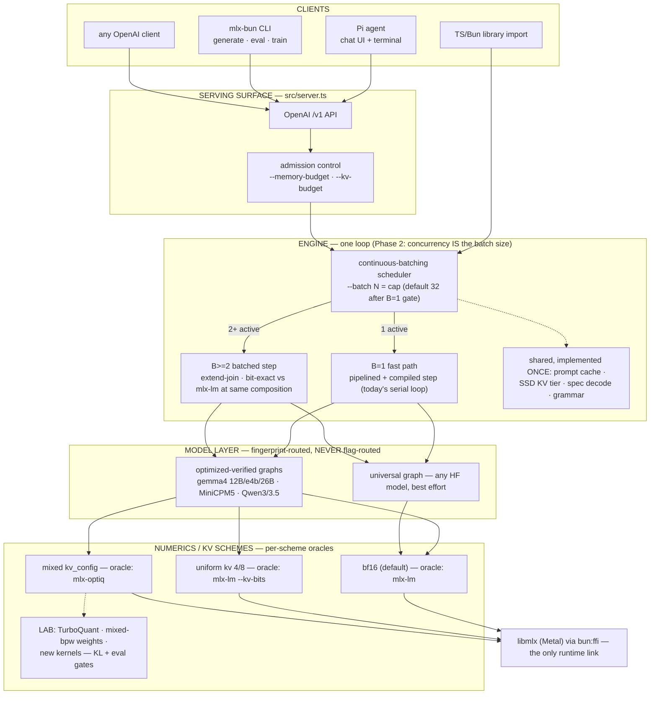
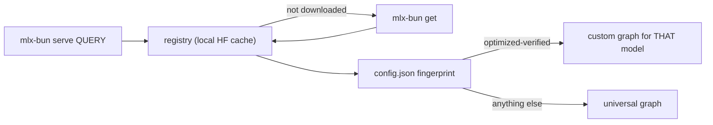

# Unified engine + the frontier program — the reorganization plan

Status: **PLAN** (2026-07-05, from the flag-architecture discussion with Josh
after the naked-=-L1 decision). This is the design that makes the library
"make sense": one engine, one honest flag surface, per-scheme oracles, and a
Lab where optimization experiments live until they earn defaults.

## 0. The goals (Josh, 2026-07-05 — the two-part product)

1. **A drop-in replacement for mlx-lm: support EVERYTHING they do, with
   bit-exact parity.** This is the default. Parity is only DEFINED over
   outputs mlx-lm can produce — you cannot ask for "mlx-lm's bits under
   mixed-precision KV" because mlx-lm cannot output anything under it.
2. **Beyond mlx-lm — features you opt into by deliberately trading the
   parity guarantee for something you value MORE**, each answering to its
   own oracle (whoever already ships it):
   - **multi-model switching** (oracle: optiq per-request switching / oMLX
     EnginePool) — ❌ missing today; the newest backlog item (layer 4).
   - **mixed-precision KV cache** (oracle: optiq) — ✅ serial, bit-exact;
     ✅ **under batching for all-full-attention configs (LANDED 2026-07-05
     — Phase 3.1 P1: cpm5 end-to-end, per-row bit-exact vs the optiq
     composition; no other stack ships this)**; rotating-layer configs
     (gemma) = milestone 2.
   - **prefix sharing** (oracle: vLLM/SGLang) — ⚠️ whole-prefix reuse only;
     true cross-request sharing (one system prompt's KV, N rows) missing.
   - **prompt caching** (oracle: mlx-lm's LRUPromptCache) — ✅ byte-capped
     + SSD cold tier beyond anyone; ❌ batched rows → Phase 3.2.
   - **structured outputs** (oracle: oMLX/xgrammar) — ✅ serial + batched,
     byte-identical vs oMLX; composes with spec decode.

Supersedes: batching-v2-plan.md's standing decision that `--batch N` is a
mode switch (reversal documented in §4, with the new rationale — the old
rejection's determinism argument is answered, not ignored). Builds on:
faithful-l1-consolidation.md (the L1 baseline, now the naked default),
parity-tier-dag.md (per-scheme oracles), omlx-adoption-map.md (survey),
batching-perf-path.md (the B=1 gap numbers this plan must close).

---

## 1. North star: beyond the Pareto frontier

The claim we are building toward: **"the best way to run local AI on a Mac."**
Formally: every (model, workload) point we ship should sit on or beyond the
current local-inference Pareto frontier in this space:

| axis | direction | measured by |
|---|---|---|
| memory | less is better | generation peak (Metal), fit-model predictions |
| decode tok/s | more | bench-h2h (stable cells only) |
| prefill / TTFT | faster | bench-h2h, server TTFT |
| throughput | higher | batched aggregate tok/s (bench-serving-load) |
| intelligence | higher | frozen eval suite (MMLU/GSM8K/IFEval/HumanEval/BFCL/HashHop, evals.sqlite) |

**THE CONTRACT (Josh, 2026-07-05):** two rules, and they compose:

1. **The drop-in promise: we must produce the SAME BITS as mlx-lm** — the
   original oracle. How the bits are produced (storage, kernels,
   scheduling, engine, language) is the space we compete in.
2. **The oracle for ANYTHING is whoever already does that thing.** Want
   mlx-lm's decode → mlx-lm is the oracle. Want optiq's mixed KV → optiq.
   Want vLLM's paged attention → **vLLM is the oracle**: read their
   implementation, copy what they did, verify against them, then optimize.
   This is the standing house method (FaithfulMiniCPM5 = copy mlx-lm;
   mixed KV = copy optiq; batching = copy BatchGenerator; SSD tier = copy
   oMLX). Never frame a capability someone ships as oracle-less. "No
   oracle" means NOBODY does the thing — genuine research — and that, and
   only that, is what the Lab is for.

Verification form follows the oracle's framework: same-framework oracles
(mlx-lm, optiq — same libmlx) admit bit-exact gates; cross-framework
oracles (vLLM — CUDA/PyTorch) anchor the ALGORITHM and behavior (block
semantics, sharing correctness, utilization), while rule 1 still binds the
final output bits in the default regime. "Faithful" kernel-set identity is
the easiest route to same-bits, not the contract; the one constraint
bit-exactness puts on implementations is math/reduction order (the perf
kernel died exactly there).

Two consequences drive everything below:

- **The baseline must be even and proven before optimizing.** We now have it:
  the L1 faithful path is bit-exact with mlx-lm at 1.00× speed on every
  model. Anything that claims to beat it proves it with a paired A/B on a
  stable pass — otherwise it is noise or a regression (2026-07-05 evidence:
  every output-changing lever failed this bar).
- **Frontier-shifting work is usually a *quality-per-byte* play, not a raw
  kernel play.** Mixed-precision quantization (weights AND KV) moves memory
  down while holding or raising intelligence — a genuine beyond-the-frontier
  move, unlike micro-kernel wins that trade along it. This is why quantized
  KV stays first-class even though it lost the speed A/B: it buys context
  headroom (12B@16k: −1.3 GB, growing linearly) and mixed schemes buy
  intelligence-per-byte.

## 2. Survey — what the other engines got right (and wrong for us)

- **mlx-lm** (`server.py`/`generate.py`): the original oracle and THE
  drop-in target — and the project most similar to ours: it spans layers
  1+2+3(+4), shipping the reference graphs, native bf16 + uniform 4/8-bit
  quantized KV (`QuantizedKVCache`/`--kv-bits` — layer 2 is theirs too),
  the batched engine, and the server. Its server is **concurrency-driven
  by default** — it auto-creates a `BatchGenerator` (decode-concurrency
  cap 32, prefill concurrency, chunked `prefill_step_size`) and routes any
  batchable request into it; only non-batchable requests (draft models
  etc.) serve sequentially. There is no "batching mode" flag — the cap is
  the only knob. Count-capped prompt cache (the OOM footgun we already
  fixed by byte-capping); no quantization on the batched path.
  → **Adopt: the concurrency-driven default is our drop-in-parity behavior.**
- **vLLM**: continuous batching + PagedAttention — the KV cache is block-paged
  with a block table per sequence, which is what makes batching, long context,
  and prefix sharing *compose* instead of conflict. No batch flag; `max_num_seqs`
  caps. Chunked prefill interleaves with decode so TTFT doesn't starve running
  streams. → **Adopt (long-term): block-paged KV as the structure that unifies
  batch + quantized KV + prompt cache + SSD tier. Adopt (near-term): the
  no-mode-flag scheduler and prefill/decode interleaving policy.**
- **llama.cpp** (server): slot-based (`-np` = slot count), one shared KV
  buffer partitioned by sequence — concurrency-driven, no mode flag. KV cache
  default is **f16; quantized KV (q8_0/q4_0) is opt-in** — independent
  confirmation of our bf16-default decision. Its imatrix (importance-matrix)
  quantization is the ecosystem's calibration-driven intelligence-per-byte
  play — the same family as oQ and our knapsack `--target-bpw`.
  → **Adopt: nothing structural we don't have; validates KV defaults; imatrix
  is prior art for the §7 quant program.**
- **oMLX**: scheduler on mlx-lm's BatchGenerator + product appliances. Already
  systematically mapped (omlx-adoption-map.md): batching parity + SSD tier
  ported and won; burst decode ported and REFUTED (Python-GIL medicine, our
  disease doesn't exist); oQ quant + DFlash queued. → **Keep mining the queue;
  its engine architecture is not ahead of ours.**
- **mlx-optiq**: the L2 oracle — per-layer mixed KV (`kv_config.json`), fused
  quantized SDPA, vision sidecar. Not a batching engine. → **Its role is the
  oracle for mixed-precision schemes (§5) and the source of the next quant
  ideas (TurboQuant per Josh).**

## 3. The architecture (four layers, each with one job)

How a model becomes servable, and the promotion path:

**The model-layer philosophy (Josh's, verbatim intent):** the universal layer
is the promise that anything from Hugging Face *runs*; the optimized-verified
layer is the promise that the models we care about run *better than anywhere
else*. Promotion from universal → optimized is a defined checklist: custom
graph file, bit-exact parity goldens vs the scheme oracle, h2h bench entry at
≥1.00× vs mlx-lm, eval-suite scores recorded. "Optimized and verified" is a
badge with teeth, and the badge list is the marketing claim.

### Layer 0 — the SSD spill substrate (Josh, 2026-07-05)

Every stage that tried it found the same result: **it is almost always
faster to cache to SSD and mmap it back than to regenerate, and spilling
lets RAM be used as a cache instead of the only tier.** Three independent
implementations already prove the pattern: the SSD KV cold tier (restart
TTFT 12.1 s → 0.24 s, 0% decode overhead), MoE expert offload (page-aligned
mmap, phys footprint ≈ active params), and the byte-capped prompt cache.
Decision: extract the pattern into ONE generic substrate — content-addressed
keys (model fingerprint + scheme + adapter + producer version), zero-copy
mmap restore, byte-capped LRU eviction, corruption self-quarantine — that
layers 1/2/4 consume. Future clients: vision encoder features (oMLX
adoption-map #6), compiled xgrammar grammars, quantized-conversion results,
TurboQuant artifacts. `src/ssd-cache.ts` is the seed to generalize.

### The batching workload (Josh, 2026-07-05)

The motivating case is AGENTIC FAN-OUT: one user running many concurrent
agents against the same server. Consequences: concurrency-driven batching
(agents don't coordinate arrivals); **prefix sharing gains priority**
(agents share long system prompts — the one-shared-KV-prefix × N rows
case); per-slot adapters become a real want (different agents, different
specializations). "Single-user" in this project means single-user,
many-agents.

### Layer responsibilities (the contract, 2026-07-05)

1. **Model graph** — one forward step given hidden + caches; attention
   dispatches on the CACHE TYPE it is handed (bf16 → ops.sdpa, quantized →
   quantizedSdpa); shape-generic in B; selected by fingerprint, never flags.
   *Responsibility: numerics of a step, for any B, for whatever cache it's
   given.*
2. **KV scheme (cache classes)** — the memory format and its semantics:
   bf16 / uniform / mixed per-layer; conversion timing (bf16 prefill →
   quantize populated rows — the optiq hook semantics); in batched form the
   multi-row layout (padding, per-row rope, merge/extract/extend/filter).
   *Responsibility: the scheme PER ROW — a row's bytes and math identical
   solo or batched. This is where each scheme's oracle binds.*
3. **Engine (scheduler)** — rows: admission, solo prefill, join/merge, the
   step loop, per-row sampling, eviction, pipelining, the concurrency cap.
   Never implements scheme math; calls layer-2 operations.
   *Responsibility: how many rows and when — never what a row's bytes mean.*
4. **Serving surface** — endpoints, per-request features (adapters,
   grammar, sampling, spec policy), prompt cache (keyed fingerprint +
   effective scheme), admission budgets. *Responsibility: requests, not
   tensors.*

**Features decompose ALONG the layers (that's the model working, not
leaking).** Per-request LoRA is the worked example: layer 1 = the math (a
parameterization — `Wx + scale·B(Ax)` — oracle-gated vs mlx-lm's tuner);
layer 3 = the policy (which rows run which adapter; today one active
adapter per batch, per-slot adapters are the matrix item); layer 4 = the
surface (`adapter` field, mount/hot-swap, discovery); plus one sideways
obligation — KV under adapter A ≠ base KV, so the prompt cache keys by
adapter (the SSD tier already does). When placing a feature, name its
component at each layer and each component's gate.

**Sampling's placement (and the debranching invariant).** The model
graph's contract ENDS AT LOGITS. Sampling is *specified* at layer 4 (the
request's params become a per-row sampler closure) and *executed* at
layer 3 (each step, on each row's [1,V] slice; vectorized when all-greedy)
— it never enters layer 1. This is the load-bearing placement behind the
layer-1 debranching goal (Josh: the generated file pre-decides all ops and
shapes; the path is a serial line with no branchable checks): everything
per-request-variable is either POST-GRAPH (sampling, grammar masks, stop
logic) or DATA the fixed graph consumes (adapter weights, caches). Mixed
adapter/no-adapter batches stay branch-free via vLLM's Punica/SGMV pattern
— every row runs the adapter math, non-adapter rows at scale 0; data, not
control flow (vLLM = the oracle for per-slot LoRA batching). Debranching
backlog: the per-token runtime checks still in generated files (`L > 1`,
`fusedSdpaRuntimeOk`) are per-GENERATION-decidable → hoist them out of the
token path; compiled decode already achieves the fully-debranched line
dynamically (trace once, replay).

**The option surface IS the four layers.** Users adjust: (1) how the model
graph works — universal vs optimized file, compiled decode, future
unrolled/fused variants; (2) how the quantization works — weights bpw,
KV scheme, future TurboQuant; (3) how the scheduler works — concurrency
cap, KV budget, prefill chunking, spec policy; (4) the serving surface —
endpoints, adapters, structured output, sampling defaults, caches,
multi-model. Flags, help text, and reference docs should be ARRANGED in
these four groups.

**Composition truth (2026-07-05, source-verified to the line AND
empirically proven live):** "does mixed-precision KV work with batched
requests?" — optiq serve as shipped: **NO** (install_mixed_kv hooks
stream_generate, the serial path; mlx_lm.server 0.31.3 contains zero
quantization in its 1,904 lines and BatchKVCache has no to_quantized —
batchable requests decode bf16). **Live 2×2 proof** (optiq serve, cpm5,
9,132-token prompt, 128-tok decode, fresh server per arm; seeded requests
route serial per mlx-lm's `_is_batchable`): batched path decode is
IDENTICAL with and without --kv-config (120.5 vs 120.6 tok/s — the config
is inert there), while the serial path drops 148.7 → 32.7 tok/s when the
mixed hook engages (4.5× slower at this context in the shipped python
pipeline). So optiq's composed reality today: batched requests silently
bf16; quantized requests pay a heavy serial penalty. Phase 3.1's batched
mixed-KV at full engine decode speed is an uncontested frontier point. mlx-bun
today: **NO** (willBatch routes shape.kvQuant serial). mlx-bun after Phase
3.1: **YES — the build**, and a first on this stack. In layer terms the
limitation is purely layer 2: the quantized schemes only have single-row
implementations, so layer 3 has nothing to call — not an engine limitation,
not a model limitation. Phase 3.1 = give layer 2 batched quantized caches
(copy the serial per-row ops that already bit-match optiq), teach layer 3 to
call them at join/evict, hand layer 1 what it already dispatches on, then
delete `shape.kvQuant` from willBatch — that deletion IS the feature.
Bonus finding from the same review: optiq's Mac-safe concurrency default is
**8** (they warn mlx-lm's 32 OOMs unified memory under burst) — adopt 8 as
the `--batch` default, superseding the earlier 32.

## 4. The engine: concurrency IS the batch size

**Decision (Josh, 2026-07-05): batching is determined by how many concurrent
requests are in flight, not by a flag.** One request = batch of 1 at full
serial speed; N requests = continuous batching; requests join/leave running
batches (the extend-join machinery already landed and is token-exact vs
mlx-lm B=2).

This **reverses** batching-v2-plan.md's standing decision (`--batch N` as a
mode switch, auto-batching rejected for determinism). The old objection was
"an idle-vs-loaded server produces different numerics for the same request."
It gets a real answer, not a shrug:

1. **The L1 oracle itself behaves this way.** mlx_lm.server auto-batches by
   default; "drop-in for mlx-lm" now *requires* concurrency-driven batching.
   Our parity contract becomes: **bit-exact to mlx-lm at the same batch
   composition** — already golden-verified at B=1 and B=2.
2. Anyone who needs load-independent numerics pins the cap to 1 (see below).
3. **Batch-invariant kernels** (identical numerics regardless of B — the
   Thinking-Machines-style program) go to the Lab as a research item; if that
   ever lands, determinism-under-load comes back for free and it's an
   arXiv-lens result on Apple Silicon.

**Flag decision (Josh, 2026-07-05): the flag stays `--batch` — no rename.**
Its *semantics* change from mode switch to cap: `--batch N` = maximum
concurrent rows (mlx-lm's `--decode-concurrency` twin), **default 32**, and
`--batch 1` is the force-serial / determinism pin. TIMING: the 32 default
lands **with Phase 2, not before** — flipping it while the batched lane is
still 1.8× slower at B=1 would regress every single-request user ~44%. Until
GATE-B1-SPEED passes, `--batch` keeps today's default (1 = the serial lane).

**The crux gate — the B=1 gap.** Today the batched lane at B=1 runs cpm5 at
~149 tok/s vs 267 serial (batching-perf-path.md): the unified engine is
**1.8× off** at the composition that matters most for a single-user runtime.

**Measured 2026-07-05 (paired in-process A/B, cpm5, M1 Max): mlx-lm's own
`BatchGenerator` at B=1 runs 256.5 tok/s vs 264.6 for its `stream_generate`
— a 3.3% tax on the most host-tax-sensitive model we have.** Two
consequences: (1) the unified design is *proven achievable* — a continuous-
batching loop can serve a lone request at ~0.97× of the best serial loop,
so our lane's 1.8× gap is an implementation artifact, not an inherent cost
of the architecture; (2) our h2h 1.00× parity numbers were measured against
`stream_generate` (mlx-lm's FASTEST single-stream path), so the baseline we
match is not batched-handicapped — and `mlx_lm.server` actually serves a
single request ~3% below the number we already match. The serial lane
cannot be deleted until:

- `GATE-B1-SPEED`: unified engine at B=1 ≥ 99% of today's serial decode tok/s
  and TTFT on cpm5 + e4b + 12B (stable bench pass), and
- `GATE-B1-PARITY`: unified engine at B=1 bit-exact vs the L1 goldens (full
  logprobs, not just greedy).

How to close 1.8×: the serial lane's wins are known and portable — the
pipelined decode loop (async-eval overlap), compiled per-step graph replay,
and no per-token scheduler hops. The likely landing: **the scheduler owns
admission and join/leave; when exactly one sequence is active it executes the
same pipelined/compiled step the serial path runs today** (B=1 specialization
inside one engine — a fast path, not a second lane), falling back to the
general batched step at B≥2. Same public machinery, no gateway routing rules,
no feature×lane matrix.

**COMPOSITION IS THE PRODUCT (Josh, 2026-07-05).** The goal state, verbatim
intent: *"you start with the server, it serves an optimized version of the
model, you add on top of that mixed-precision quantized KV cache, as well as
LoRA adapters, and you add on top of that DSpark speculative decoding, and
structured output potentially, and then you also can switch the sampling
method and values."* Every serving capability is a STACKABLE layer on one
engine — never a lane-routing condition, never mutually exclusive. The
current gateway is the anti-pattern: `willBatch` routes vision / adapters /
logprobs / seeds / kv-quant / drafts to a different lane, which is exactly
the "batching OR performance" choice being killed.

The composition matrix the unified engine must satisfy (each row = a layer;
any subset of rows must stack):

| layer | today | end state |
|---|---|---|
| optimized per-model graph | ✅ both lanes | ✅ (fingerprint-routed, unchanged) |
| mixed-precision quantized KV | serial only | one active scheme per server, applies at any B |
| LoRA adapters (hot-swap, per-request select) | serial only (compiled decode also skips them) | per-slot adapter state in the batched step |
| speculative decoding (two-model today, DSpark next) | serial only, forces ALL requests serial | per-slot drafting behind the `DraftSource` seam |
| structured output (grammar) | ✅ both lanes (B1 per-row matchers) | ✅ (already composes; keep the conformance gate) |
| sampling method + values (temp/top-p/top-k/min-p/XTC/penalties/HLG/seed) | per-row samplers batch; seeds force serial | fully per-row, seeds included |
| prompt cache / SSD tier | serial only | prefix reuse for batched rows |

Ordering (by value): quantized KV under batching first (the
agent-fan-out-with-long-context composition), then prompt cache, then
adapters, then spec decode per slot, then chunked prefill interleaving
(vLLM policy) so a 16k prefill doesn't stall running streams.
`scripts/bench-modes.ts` is already the composition scoreboard (its cell
matrix spans kv × batch × grammar × cache × spec) — every layer added to
the batched engine gets a cell there and a parity gate.

## 5. Fidelity: per-SCHEME oracles (fixes "L1 can't oracle mixed")

The tier ladder stops being a product mode and becomes what it always really
was — a **map from numeric scheme to its verification oracle**:

| scheme | oracle | verification |
|---|---|---|
| bf16 (default), any batch B | **mlx-lm** at same composition | bit-exact goldens (serial + B=2 landed) |
| uniform kv 4/8 | **mlx-lm** `--kv-bits` (+ optiq's rotating cache class where upstream is NYI) | bit-exact (kv-quant.test) |
| mixed per-layer kv (`kv_config.json`) | **mlx-optiq** `install_mixed_kv` | bit-exact (mixed-kv-parity.test, landed 2026-07-05, maxDiff 0) |
| mixed-precision weights (knapsack/oQ/TurboQuant), original kernels, batch-invariant kernels | **none exists** → Lab gates | KL vs our own reference path + frozen eval suite (intelligence axis) + envelope tests + kill switch |

So: mixed-precision quantization is NOT demoted by the naked-=-L1 decision —
it is the flagship of the row that mlx-lm cannot oracle, verified against
optiq where optiq reaches (KV) and against the eval suite where no oracle
exists (weights). `--l1/--l2` survive as *bench/test vocabulary* for the
first three rows; they stop being user-facing product modes.

**Composition rule (Josh, 2026-07-05): a composition inherits its scheme's
oracle.** Batching, prompt cache, spec decode, adapters — none of them
change a scheme's numerics, so composing them with a scheme verifies
against THAT SCHEME'S oracle, per row. Batched bf16 anchored to mlx-lm
(B=N token-exact goldens); batched mixed-KV anchors to the L2 oracle the
same way: copy optiq's per-row quantization mechanics (`install_mixed_kv`'s
per-layer map + streaming `to_quantized` + RotatingQuantizedKVCache — our
serial `maybeQuantizeKv` is already the verified op-for-op copy), then
gate on per-row bit-exactness against it (row cache contents; B=1 through
the engine vs the mixed-KV golden; B>1 trajectories at the standing
long-prefix bar). Do NOT invent Lab-style KL/teacher-forced gates for a
composition of an oracle-backed scheme — the Lab is only for schemes with
no oracle at all (new quant methods, original kernels).

## 6. The flag surface (end state — every flag with its reason)

User-facing serve/generate flags after the deletion pass:

| flag | why it exists |
|---|---|
| `--kv-quant config\|4\|8\|off` | the ONE performance trade-off a user makes: decode speed vs context headroom (+ intelligence-per-byte with mixed). Default off (bf16). Composition (fused vs unfused quantized SDPA) is DERIVED from the scheme's oracle, not chosen. |
| `--batch N` | cap on concurrent rows (mlx-lm's `--decode-concurrency` twin). Default 32 once Phase 2's B=1 gate passes; `--batch 1` = force-serial / determinism pin. Name kept (Josh 2026-07-05) — semantics change from mode to cap. |
| `--draft-model`, `--num-draft-tokens` | speculative decoding (mlx-lm parity) |
| `--adapter`, `--memory-budget`, `--kv-budget`, `--prompt-cache`, `--ssd-cache`, `--expert-offload`, `--force-wire` | capacity/serving features, not numerics levers |
| sampling flags (`--temperature` etc., HLG family) | request-default sampling |

Everything else becomes either a **kill switch** (env-only, documented for
debugging: `MLX_BUN_COMPILED_DECODE=0`, `MLX_BUN_COMPILED_GEGLU=0`,
`MLX_BUN_NO_FUSED_SDPA=1`) or a **Lab flag** (env-only, lives with its bench
script and expiry — §7). Kill switches are bit-exact by definition (they
select a slower same-parity path); anything output-changing is Lab.

**Deleted — EXECUTED 2026-07-05** (one funeral each; ~50 files touched, 23
deleted, suite green):
- `--fused-decode` / `MLX_BUN_FUSED_DECODE` — 1.00×, forces uncompiled,
  silent-wrongness footgun. Delete kernel path + flag + backstop throw.
- `--fused-gelu` / `MLX_BUN_FUSED_GELU` + `MLX_BUN_FUSED_SWIGLU` — +0–1%;
  the compiled closures already own the fusion win bit-exactly. Delete both
  custom Metal kernels + flags (git history keeps the source).
- `--perf-kernel` / `MLX_BUN_PERF_KERNEL` — **DELETE** (Josh 2026-07-05:
  "we are going to start a full optimization program anyway… we will end up
  redoing all the work we have currently done given that we now have a
  different starting point"). The kernel, its frozen-oracle test scaffolding
  (perf-kernel-oracle.test.ts, freeze-perf-oracle.ts), and the flag all go;
  git history + the h2h evidence (+6% 12B@16k, −38% e4b@16k, KL WARN) are
  the breadcrumb. If a flash-decode kernel returns, it's re-derived from the
  L1 baseline in the Lab under the §7.4 program, not resurrected.
- `MLX_BUN_CPM5_FAITHFUL` + `FaithfulMiniCPM5` — the default IS the faithful
  path now; the A/B reference served its purpose.
- `--l3` as a product mode — the Lab replaces it; the flag now hard-errors
  with a pointer here. `--l1`/`--l2` stay as documented aliases.
- Also deleted with the fused-swiglu family: `fused-mlp-kernel.ts` and
  `steel-linear-kernel.ts` (only reachable through the deleted gates) and
  the ~17 `scripts/experiments/swiglu-*`/geglu/steel one-off scripts.
- Training flag sanitization (`MLX_BUN_PERF_KERNEL=0` / `MLX_BUN_FUSED_GELU=0`
  in trainers/launchers/recipes) — obsolete; the no-vjp kernels it guarded
  against no longer exist.

**Lab lifecycle rule** (the anti-flag-pile law): every Lab experiment ships
with (a) a hypothesis stated in frontier-axis terms, (b) a paired A/B bench
script, (c) an expiry review date. Outcomes: promote to default (with the
stable-pass numbers) or delete (with a breadcrumb in the design doc). No
third state. "Off in every regime with no promotion path" — the fused-decode
condition — is a deletion that hasn't happened yet.

## 7. The frontier program (AFTER stability — the order matters)

Phase gate: none of this starts until §8 phases 0–2 are done. "Now we
finally have a baseline that is even and proven; investigate THAT."

Ranked by expected frontier shift (memory ↓ / intelligence ↑ first, then
speed):

1. **Mixed-precision weights** — knapsack `--target-bpw` (ours) vs oQ
   (calibration-driven sensitivity, omlx-adoption-map §4) vs llama.cpp
   imatrix as prior art. Gate: perplexity + frozen 6-task eval at equal bpw.
   The purest beyond-the-frontier play we know: same memory, more
   intelligence. (arXiv-lens candidate.)
2. **TurboQuant KV** (Josh) — ORTHOGONAL to mixed precision and composes
   with it: mixed precision is the ALLOCATION axis (how many bits per
   transformer layer, optiq's sensitivity map), TurboQuant is the
   QUANTIZER axis (how a given bit budget encodes each K/V vector, within
   a layer — rotation-based, online, calibration-free). Composition =
   sensitivity allocation × better quantizer: more fidelity at the same
   KV bytes. Architecture: a layer-2 cache format + a layer-1 attention
   kernel keyed by cache type (same shape as optiq's scheme). Oracle: the
   paper + its reference implementation anchor the ALGORITHM (read them
   first, per the oracle rule); the output is genuinely novel (no serving
   stack ships it) → eval-suite gates. Composes with Phase 3.1's batched
   quantized buffers.
3. **Speculative decoding depth** — DFlash/DSpark behind the existing
   `DraftSource` seam; decode tok/s at zero quality cost when drafts land.
4. **Per-model graph work from the baseline** — the optimized-verified
   layer's whole point: unroll a model's flat DAG, find fusion the compiler
   misses, prove with kernel-trace diffs, promote per model. The perf-kernel
   root-cause lives here.
5. **Batch-invariant kernels** (research) — restores determinism-under-load;
   novel on Apple Silicon.

## 8. Migration phases (each with a hard gate)

- **Phase 0 — measure the gap** — **DONE 2026-07-05** (M1 Max, same server
  harness both lanes, median-of-5, bf16 KV):

  | model | serial B=1 | batch-lane B=1 | ratio | extra host ms/token | TTFT serial→batch |
  |---|---|---|---|---|---|
  | cpm5 | 281.4 tok/s | 128.8 | 0.46× | +4.2 ms | 44 → 55 ms |
  | e4b  | 62.1 | 44.9 | 0.72× | +6.2 ms | 54 → 121 ms |
  | 12B  | 29.8 | 25.6 | 0.86× | +5.5 ms | 82 → 251 ms |

  The overhead is a roughly CONSTANT ~4–6 ms per decode step, independent of
  model size → per-step host tax, not GPU work. cpm5 (which never uses
  compiled decode) pays it too, so compiled-decode's absence is not the
  story. Suspects (in dispatch-site order): the `setImmediate` macrotask hop
  per drive-loop iteration, per-step per-layer `BatchedDecodeMaskCache`
  construction + mask materialization at B=1 (serial passes caches bare with
  an empty mask), and the per-token emit path. TTFT gap = solo-prefill +
  merge + admission hops. Closure worklist = profile these three, in order.
- **Phase 1 — the deletion pass** (§6): dead kernels, flag surface, docs,
  Lab scaffolding (move perf-kernel + its bench + oracle tests). Gate: full
  suite green; naked defaults byte-identical to today's L1 route.
- **Phase 2 — engine unification** — **DECODE GAP CLOSED 2026-07-05.** The
  ~4–6 ms/step host tax decomposed into exactly two bugs, both fixed:
  1. **The pipelined token read enqueued an `astype` kernel** —
     `prev.toFloat32()` on the int token array created a NEW cast op that
     queued BEHIND the entire just-dispatched next step on the GPU stream,
     stalling the "overlapped" read for a FULL step of GPU work every
     token (this alone was the bulk of the gap; zero host/GPU overlap,
     proven by NO_PIPELINE ≈ pipelined). Fix: `MlxArray.toIntTokens()` —
     eval + raw uint32/int32 buffer read, no cast (mirrors serial's
     `itemUint32`).
  2. **Per-layer per-step mask/rope wrapper churn**: `#step` rebuilt a
     `BatchedDecodeMaskCache` + array mask for every full layer every
     token even when no row had left padding. Fix: the unpadded fast path —
     bare caches (KVCache.makeMask(1) = the empty mask, scalar rope) →
     the batch step dispatches the SAME graph the serial loop builds.

  Measured after (B=1 through the batch lane, same SSE harness as Phase 0):
  cpm5 129→**264** (serial 281 SSE / in-process ratio **0.994**), e4b
  45→**57.6** (0.93 — remainder = compiled decode, serial-only today),
  12B 25.6→**29.7** (**1.00**). Batched parity oracles green (11/11
  applicable; the CPM extend-join golden failure PRE-EXISTS this work —
  proven by stash/rerun — and is logged as an open item).
  **Remaining before the `--batch` 32 default flip**: compiled decode
  inside the B=1 step (e4b's last 7%), prompt cache for batched rows
  (TTFT: serial hits the cache on repeat prompts, batch re-prefills —
  e4b 126 vs 54 ms, 12B 246 vs 82 ms), then GATE-B1-SPEED ≥99% on all
  three + GATE-B1-PARITY (bit-exact vs L1 goldens) + B=2 goldens intact.
- **Phase 3 — composition**: quantized KV under batching — **P1 LANDED
  2026-07-05**: src/model/batched-quant.ts (merge/extend/filter over
  triples + BatchedQuantDecodeMaskCache), scheduler solo-conversion at the
  serial chunk boundaries, gateway kv-batchability memo (all-full-attention
  kvConfig batches; uniform/rotating stays serial; scheme-less gateway
  refuses — never silently drop quantization, the optiq bug class). Gates
  green: B=1 through the scheduler BIT-EXACT vs the cpm5 optiq golden
  (decode steps, maxDiff 0); B=2 dynamic join — unpadded row BIT-EXACT vs
  solo at every step, padded row within the calibrated envelope (5e-2;
  bf16 same-harness shows ~9e-3 — the pre-existing reduction-order noise,
  amplified by grid snapping; scripts/experiments/batched-quant-kl-profile
  .ts). E2E: --batch 2 --kv-quant config on cpm5 = /stats active_rows 2,
  400 tok @ 240 tok/s aggregate, coherent output. NEXT: milestone 2
  (batched rotating-quant for gemma configs), prompt-cache reuse for
  batched rows, chunked prefill interleaving. Gate per feature: parity +
  no aggregate-throughput regression at B=4.
- **Phase 4 — the frontier program opens** (§7 order).

## 9. Decisions log (was: open questions)

1. **Cap default 32** (Josh 2026-07-05) — lands with Phase 2 (see §4 timing
   note); kv-budget admission keeps it safe on small boxes.
2. **Flag stays `--batch`** — no rename; semantics become the cap;
   `--batch 1` = force-serial pin.
3. **Perf kernel: deleted in Phase 1** (§6) — the optimization program
   re-derives from the L1 baseline; no resurrection.
4. Still open: PagedAttention-style block KV — Phase 3 follow-up or its own
   design doc when prefix sharing under batching becomes the bottleneck.
